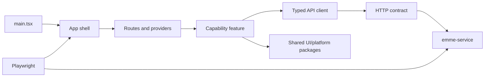

# EMME Web


[](https://github.com/migangdelzar/emme-web/actions/workflows/ci-frontend.yml)

EMME Web is the React/Vite browser application for salon operations. It is a
standalone Bun workspace with capability-oriented frontend modules, typed API
packages, localized UI, PWA assets, and Playwright browser journeys.

> **Backend partner:** [emme-service](https://github.com/migangdelzar/emme-service)

The web repository owns presentation and interaction. The service repository
owns authorization, tenancy, validation, persistence, and business truth.

## Architecture at a glance



## Quick start

### Prerequisites

| Tool | Version | Purpose |
|---|---:|---|
| Bun | 1.2.x | Workspace install, scripts, and test runner |
| Node-compatible shell | Current | Tooling interoperability |
| Docker | Current, optional | Container and integrated E2E workflows |
| emme-service | Sibling checkout | Real backend API journeys |

Expected integrated layout:

```text
workspace/
├── emme-service/
└── emme-web/
```

```bash
git clone https://github.com/migangdelzar/emme-web.git
cd emme-web

bun install --frozen-lockfile
bun run dev
```

The Vite application runs at `http://localhost:3000`. Copy
`apps/emme-salon-app/.env.example` to a local `.env` and set only public
browser configuration. Never put private provider keys in `VITE_*` variables.

## Repository structure

```text
apps/emme-salon-app/  Main React/Vite/PWA application
packages/api-client/  HTTP transport and client boundary
packages/contracts/   Typed API/domain transport contracts
packages/i18n/        Locale catalogs and translation helpers
packages/ui/          Reusable presentational primitives
packages/validation/  Shared boundary validation
e2e/src/              Playwright journeys and test providers
docs/                 Frontend and integration architecture
```

## Frontend boundaries

```text
apps/emme-salon-app/src/
├── app/          Composition root, routes, and providers
├── auth/         Session and tenant selection behavior
├── features/     User-facing capabilities
├── api/          Feature API adapters and query hooks
├── shared/       Deliberately reusable UI and layout
├── config/       Validated public runtime configuration
└── main.tsx      Browser entry point
```

Features own user outcomes and feature state. The app shell owns routing and
cross-feature providers. Shared code must be stable and genuinely reused.
Backend internals are never imported; all communication crosses the typed HTTP
contract through `@emme/api-client` and `@emme/contracts`.

## Verification

```bash
bun run typecheck
bun run lint
bun run test
bun run build
```

For real browser verification, start the sibling backend and run:

```bash
E2E_MODE=real bun run --filter @emme/e2e test:real
```

The default `test` command is intentionally limited to unit/component tests.
Run `bun run test:e2e` for Playwright; critical real journeys require the
sibling backend, deterministic users/tenants, and must not commit tokens,
recordings, or environment files.

## Documentation

| Topic | Location |
|---|---|
| App shell | [`docs/architecture/02-frontend/app.md`](docs/architecture/02-frontend/app.md) |
| Frontend modules | [`docs/architecture/02-frontend/module.md`](docs/architecture/02-frontend/module.md) |
| Features | [`docs/architecture/02-frontend/feature.md`](docs/architecture/02-frontend/feature.md) |
| React boundaries | [`docs/architecture/02-frontend/react.md`](docs/architecture/02-frontend/react.md) |
| Vite | [`docs/architecture/02-frontend/vite.md`](docs/architecture/02-frontend/vite.md) |
| Testing | [`docs/architecture/02-frontend/testing.md`](docs/architecture/02-frontend/testing.md) |
| Backend integration | [`docs/architecture/03-integration/frontend-backend.md`](docs/architecture/03-integration/frontend-backend.md) |

## License

Proprietary. See the service repository and project policy before distributing
the application or generated assets.
