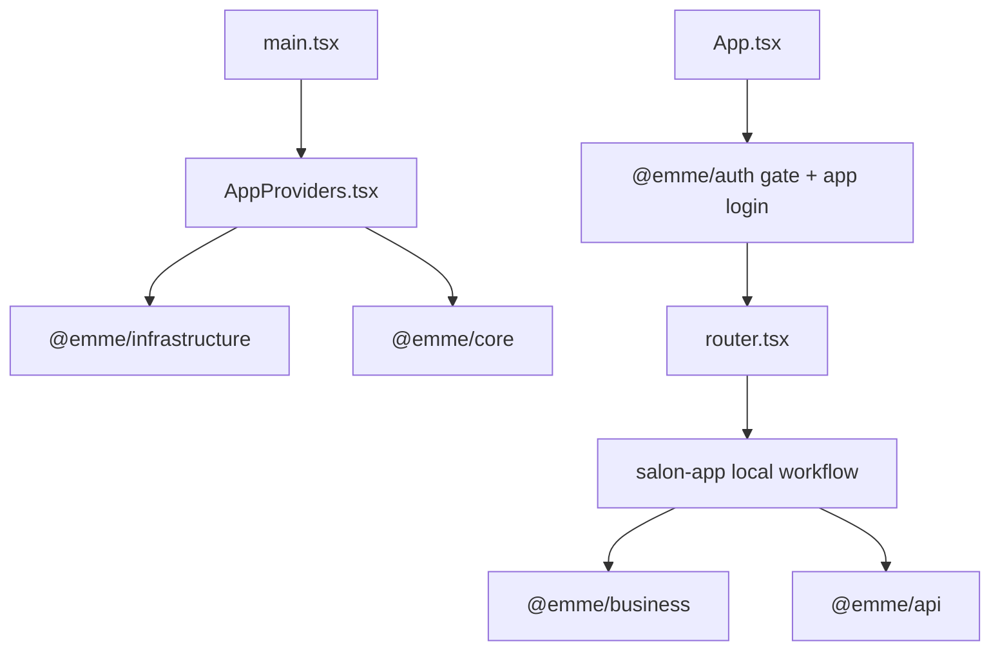

# App Shell and Workflow Structure

Each app is an independent composition root and deployable artifact. All three
shells share the authentication gate primitive through `@emme/auth`; each app
owns its own login presentation. Current product features are owned by
`salon-app` only.

## Shell template

```text
apps/<app>/src/
├── app/
│   ├── App.tsx
│   ├── AppProviders.tsx
│   ├── router.tsx
│   ├── config/               # validated public runtime config when needed
│   ├── layouts/              # app-wide layout when needed
│   └── error-boundary/       # normalized error UI when needed
├── features/                 # app-owned vertical workflows
└── main.tsx
```

`AppProviders` creates the runtime contexts and injects infrastructure. `App`
composes `AuthGate`, app-local signed-out/tenant fallbacks, layouts, and routes.
Backend authorization remains authoritative.

## Salon app

```text
apps/salon-app/src/features/
├── appointments/{api,components,hooks,mappers,presentation,shared,validation}/
├── auth/components/
├── clients/{api,components,domain,hooks}/
├── dashboard/{components,hooks}/
├── finances/{components,hooks}/
├── google-workspace/{components,hooks}/
├── navigation/
├── onboarding/{api,application,components,infrastructure,presentation,test}/
├── services/{api,components,domain,hooks,mappers}/
├── settings/{api,components,context,hooks}/
├── shared/{apiErrorMessage,queryFactory,uiStore}.ts
└── feature-boundary.test.ts
```

Salon owns the current pages, hooks, feature state, role workflows, API
composition, and business-specific components. Reusable framework-free rules
and use cases are consumed from `@emme/business`.

## Admin and client apps

```text
apps/admin-app/src/
├── app/{App,AppProviders,router,routes}/
├── features/{auth,feature-flags,provisioning}/
└── main.tsx

apps/client-app/src/
├── app/{App,AppProviders,router,routes}/
├── features/{auth,calendar}/
└── main.tsx
```

The admin and client applications remain separate deployable shells so their
security policies, URLs, environments, releases, and rollback paths stay
independent. They may render the shared `@emme/auth` gate and call shared
API/core packages, but their login pages remain local and they do not consume
salon product features or private salon feature paths.

## Composition flow



## Checklist

- [ ] Each app has its own build, runtime configuration, and production image.
- [ ] All three apps use the shared auth gate with app-local login pages.
- [ ] Salon product features remain under `apps/salon-app/src/features`.
- [ ] Admin/client shells do not import salon feature internals.
- [ ] Concrete infrastructure is created only in composition-root wiring.
- [ ] Route, auth, loading, error, and workflow tests exist for active flows.
