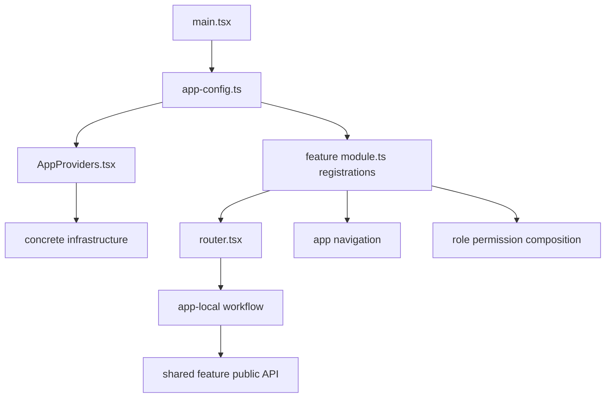

# App Shell and Workflow Structure

Each app is a composition root. It owns routing, layouts, navigation, branding,
role-specific permission composition, app forms and filters, and workflow
orchestration. Concrete dependencies are instantiated only at composition-root
registration.

## Canonical shell

```text
apps/<app>/src/
├── app/
│   ├── App.tsx
│   ├── AppProviders.tsx
│   ├── app-config.ts
│   ├── router.tsx
│   ├── routes/
│   ├── layouts/
│   └── error-boundary/
├── features/
├── config/
├── theme/
└── main.tsx
```

Every app feature owns these registration files in addition to its workflow
implementation:

```text
<app-feature>/
├── routes.tsx
├── navigation.ts
├── permissions.ts
└── module.ts
```

`module.ts` registers the feature's routes, navigation, permissions, and
capability dependencies with the app composition root. It does not instantiate
global infrastructure outside registration.

## Salon app workflows

The physical application and package names remain `apps/emme-salon-app` and
`@emme/emme-salon-app`.

```text
apps/emme-salon-app/src/features/
├── appointments/
│   ├── calendar/
│   ├── manage/
│   ├── availability/
│   ├── routes.tsx
│   ├── navigation.ts
│   ├── permissions.ts
│   └── module.ts
├── catalog/{routes.tsx,navigation.ts,permissions.ts,module.ts}
├── customers/{routes.tsx,navigation.ts,permissions.ts,module.ts}
├── staff/{routes.tsx,navigation.ts,permissions.ts,module.ts}
├── settings/{routes.tsx,navigation.ts,permissions.ts,module.ts}
├── onboarding/{routes.tsx,navigation.ts,permissions.ts,module.ts}
├── analytics/{routes.tsx,navigation.ts,permissions.ts,module.ts}
└── integrations/{routes.tsx,navigation.ts,permissions.ts,module.ts}
```

The app consumes shared appointments, catalog, customers, staff, payments,
integrations, tenant-configuration, onboarding, and analytics public APIs. Its
calendar, management, availability, settings, onboarding, dashboard/analytics,
and staff-facing integration flows remain app-owned.

## Client app workflows

```text
apps/client-app/src/features/
├── booking/
│   ├── BookAppointmentPage.tsx
│   ├── ServiceSelectionStep.tsx
│   ├── DateSelectionStep.tsx
│   ├── TimeSelectionStep.tsx
│   ├── BookingConfirmation.tsx
│   ├── useBookingFlow.ts
│   ├── booking.schema.ts
│   ├── routes.tsx
│   ├── navigation.ts
│   ├── permissions.ts
│   └── module.ts
├── my-appointments/
│   ├── MyAppointmentsPage.tsx
│   ├── AppointmentDetailsPage.tsx
│   ├── useMyAppointments.ts
│   ├── appointmentFilters.schema.ts
│   ├── routes.tsx
│   ├── navigation.ts
│   ├── permissions.ts
│   └── module.ts
└── cancellation/
    ├── CancelAppointmentDialog.tsx
    ├── useCancelOwnAppointment.ts
    ├── routes.tsx
    ├── navigation.ts
    ├── permissions.ts
    └── module.ts
```

The broader client app may also own auth, profile, discovery,
communications, and calendar workflows. The tree above is the canonical
appointment ownership example: it consumes shared feature policies and
capabilities but keeps the customer journey local.

## Platform-admin app workflows

```text
apps/platform-admin-app/src/features/
├── search/
│   ├── PlatformAppointmentsPage.tsx
│   ├── TenantAppointmentFilters.tsx
│   ├── usePlatformAppointments.ts
│   ├── routes.tsx
│   ├── navigation.ts
│   ├── permissions.ts
│   └── module.ts
└── audit/
    ├── AppointmentAuditPage.tsx
    ├── AppointmentAuditTimeline.tsx
    ├── useAppointmentAudit.ts
    ├── routes.tsx
    ├── navigation.ts
    ├── permissions.ts
    └── module.ts
```

Tenant lifecycle, feature flags, memberships, provisioning, subscriptions, and
other platform operations follow the same metadata pattern and remain local to
the platform-admin app. No platform-only route or policy is forced into a
tenant feature.

## Composition-root registration



See [runtime configuration](../01-runtime/configuration.md) for complete
`defineAppConfig` and `defineModule` examples.

## App structure checklist

- [ ] The app shell matches the canonical shell tree.
- [ ] Each app feature has `routes.tsx`, `navigation.ts`, `permissions.ts`, and
      `module.ts`.
- [ ] Role-specific pages, filters, forms, and orchestration remain app-local.
- [ ] Shared business behavior is consumed only through feature public exports.
- [ ] Concrete infrastructure is created only in composition-root wiring.
- [ ] No app imports another app's internals.
- [ ] Route, permission, tenant, loading, error, and workflow tests are present.
