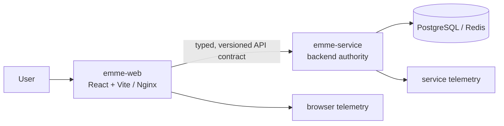
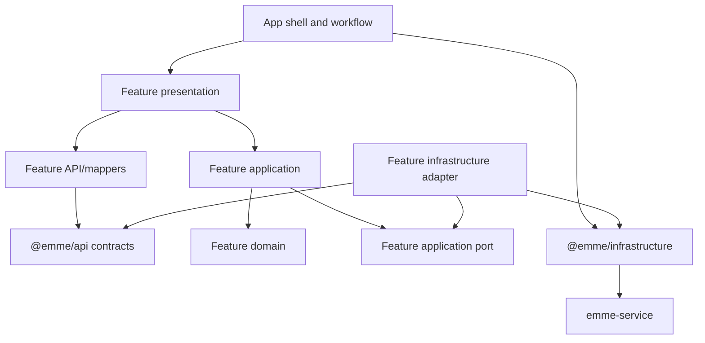

# Frontend Architecture Model

> **Status: Updated.** This retained overview now reflects the canonical
> vertical-feature ownership model. The previous global `@emme/domain` and
> `@emme/application` dependency diagram is superseded.

## Two-repository ownership

The web repository owns presentation, interaction, browser composition, and
transport consumption. The service repository owns authorization, tenant
isolation, canonical validation, persistence, business invariants, and event/
HTTP contracts.

The repositories release independently while contracts remain compatible. A
breaking contract requires a coordinated compatibility window and migration.

## Vertical ownership

The invariant is vertical business ownership: a reusable feature contains its
own domain and application layers. Global packages own only genuinely
cross-cutting primitives, runtime, transport contracts, and technical adapters.

## Rules

- A frontend feature owns a user or business outcome, not a backend table.
- UI consumes typed contracts and adapters, never service internals.
- Shared packages are stable and deliberately reusable; framework awareness is
  allowed only where documented.
- Authentication and authorization decisions remain server-side; route guards
  improve UX but are not security controls.
- Browser configuration distinguishes public values from private secrets.
- Network, time, storage, and browser APIs remain visible at adapter boundaries.
- App workflows consume feature public exports and never another app's internals.

## Verification

- TypeScript strict checks and package dependency review.
- Public-export and forbidden-import boundary tests.
- Domain, application, schema, mapper, adapter, and component tests.
- Playwright for critical mocked and configured real-stack journeys.
- Accessibility, security, delivery, and operational evidence for changed flows.
