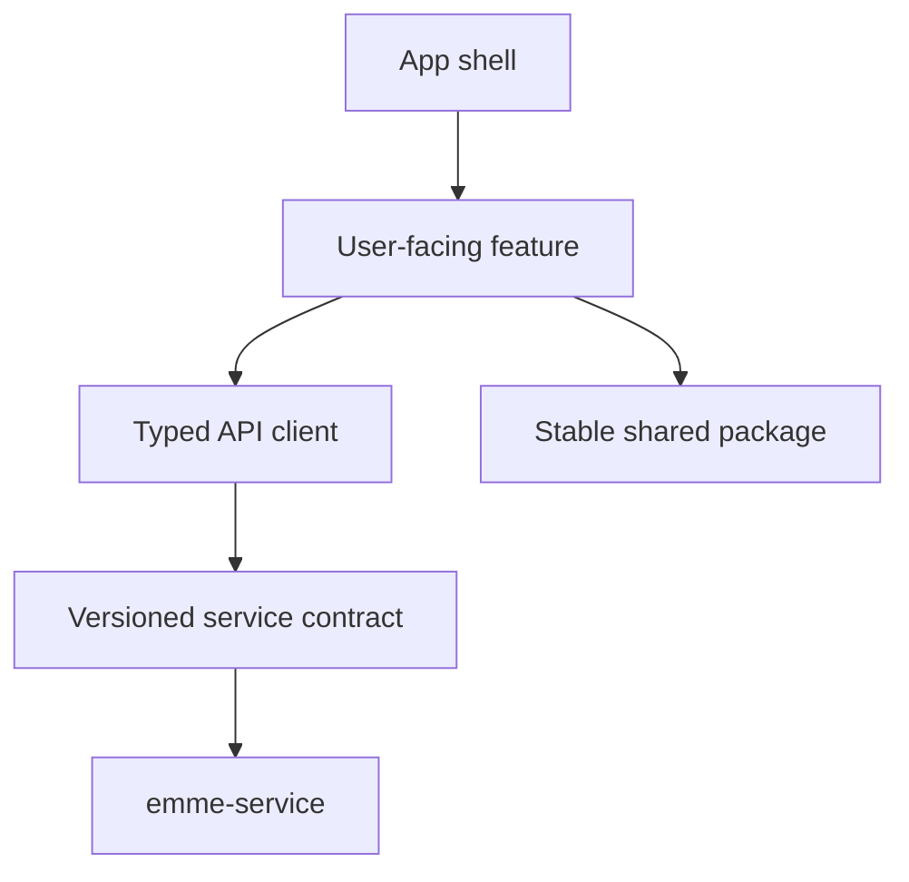
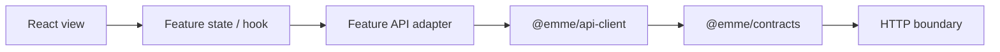

# Frontend Architecture Model

## Ownership

The web repository owns presentation and interaction. The service repository owns
authorization, tenancy, validation, persistence, business invariants, and event
contracts.

## Rules

- A frontend feature MUST own a user outcome, not a backend table.
- UI code MUST consume typed contracts and adapters, never service internals.
- Shared packages MUST be stable, deliberately reusable, and framework-aware only
  when that is their documented responsibility.
- Authentication and authorization decisions remain server-side; route guards
  improve UX but are not security controls.
- Browser configuration MUST distinguish public values from private secrets.
- Network, time, storage, and browser APIs remain visible at adapter boundaries.

## Dependency direction

## Verification

- TypeScript strict checks and package dependency review.
- Component tests for observable UI behavior.
- Contract tests for request/response mapping.
- Playwright for critical real-stack journeys.
- Accessibility and security checks for changed user flows.
