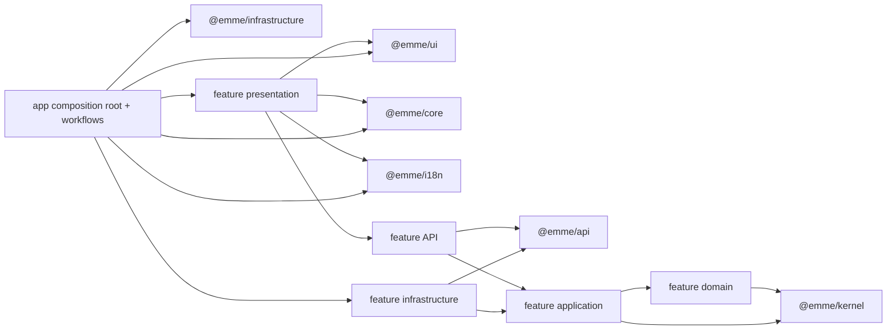

# Dependency Rules

The dependency graph points inward toward stable contracts and business rules.
Concrete dependencies enter only through an app composition root.



The diagram permits dependencies represented by arrows; it does not authorize
private-path imports. Consumers cross package or feature boundaries only
through public barrels.

## Layer rules

```text
feature domain         -> @emme/kernel
feature application    -> feature domain + @emme/kernel
feature API            -> @emme/api + feature application contracts/mappers
feature infrastructure -> @emme/api + feature application ports
feature presentation   -> @emme/ui + @emme/core + @emme/i18n + feature public APIs
apps                   -> selected features + core + ui + infrastructure + i18n
```

1. Domain code never imports React, browser APIs, transport clients, storage,
   API DTOs, infrastructure, or app code.
2. Application code depends on protocols, receives dependencies from outside,
   and never constructs a concrete adapter.
3. API code describes transport contracts; it does not implement browser or
   provider behavior.
4. Infrastructure implements ports and external behavior; it does not decide
   business policy.
5. UI has no business, API, application, infrastructure, feature, or app
   dependency.
6. Features communicate through stable public exports and never import another
   feature's private path.
7. Packages never import app code, and apps never import another app.
8. Tenant context is explicit at API/application boundaries and is never
   inferred from arbitrary UI state.
9. Expected domain/application outcomes use `Result<T, E>` with typed feature
   errors; raw transport errors do not leak into presentation.
10. Unexpected programmer or configuration faults reach the core error boundary
    and are logged without secrets.

## Public export rules

- Each package exposes only intentional symbols from `src/index.ts` and its
  declared package export map.
- Each feature exposes one `index.ts`; layer barrels may support the feature
  barrel but are not consumer entry points unless explicitly exported.
- Public exports are contracts, types, factories, and reusable presentation;
  private mappers, adapters, fixtures, and file layout remain replaceable.
- Apps import `@emme/features/appointments` or another documented export, never
  `@emme/features/src/appointments/...`.
- A cross-feature collaboration depends on the providing feature's public
  contract. If no contract exists, add one deliberately instead of deep
  importing.
- Export-map, public-barrel, and forbidden-import tests are required before a
  migration deletes the previous entry point.

## Dependency checklist

- [ ] Every import follows an arrow in the dependency diagram.
- [ ] Protocols are accepted as parameters; concrete dependencies are created
      only in app composition roots.
- [ ] Cross-boundary imports use package/feature public exports.
- [ ] Domain and application source scans contain no React, browser, transport,
      storage, infrastructure, or app imports.
- [ ] UI source scans contain no business names or feature/runtime adapters.
- [ ] Tenant and auth context is explicit where required.
- [ ] `@emme/test-support` is used only by test/dev dependencies.
- [ ] Package-boundary tests reject every forbidden direction.
