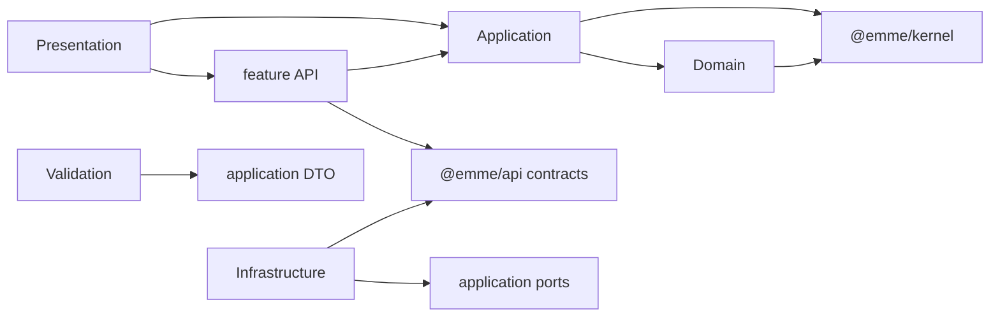

# Vertical Feature Module Structure

Reusable business behavior lives in `packages/features/src/<feature>`. Each
feature is a complete vertical Hexagon: its pure business center, use cases and
ports, transport mapping, concrete feature adapters, validation,
framework-facing presentation, translations, and tests remain together.

## Canonical template

```text
packages/features/src/<feature>/
├── domain/
│   ├── entities/
│   ├── value-objects/
│   ├── policies/
│   ├── services/
│   ├── errors/
│   └── index.ts
├── application/
│   ├── commands/
│   ├── queries/
│   ├── ports/
│   ├── dto/
│   └── index.ts
├── api/
│   ├── queries/
│   ├── mutations/
│   ├── fragments/
│   ├── mappers/
│   └── index.ts
├── infrastructure/
├── validation/
├── presentation/
│   ├── components/
│   ├── hooks/
│   └── view-models/
├── i18n/
├── test/
│   ├── fixtures/
│   ├── domain/
│   └── application/
└── index.ts
```

Domain and application are React-free. Infrastructure implements application
ports. Presentation may depend on React, `@emme/ui`, `@emme/core`, and
`@emme/i18n`, but it owns no app route, role-specific workflow, or global
runtime policy.

## Complete appointments example

The appointments module is the reference structure for complex business
features. Filenames below are part of the canonical ownership example; plans
may add behavior only within the corresponding layer.

```text
packages/features/src/appointments/
├── domain/
│   ├── entities/
│   │   ├── appointment.ts
│   │   └── index.ts
│   ├── value-objects/
│   │   ├── appointment-id.ts
│   │   ├── appointment-status.ts
│   │   ├── appointment-time-range.ts
│   │   └── index.ts
│   ├── policies/
│   │   ├── booking-policy.ts
│   │   ├── cancellation-policy.ts
│   │   ├── rescheduling-policy.ts
│   │   └── index.ts
│   ├── services/
│   │   ├── appointment-conflict-service.ts
│   │   └── index.ts
│   ├── errors/
│   │   ├── appointment-conflict-error.ts
│   │   ├── appointment-not-found-error.ts
│   │   ├── invalid-appointment-state-error.ts
│   │   └── index.ts
│   └── index.ts
├── application/
│   ├── commands/
│   │   ├── book-appointment.ts
│   │   ├── cancel-appointment.ts
│   │   ├── reschedule-appointment.ts
│   │   └── index.ts
│   ├── queries/
│   │   ├── find-available-slots.ts
│   │   ├── get-appointment.ts
│   │   ├── list-appointments.ts
│   │   └── index.ts
│   ├── ports/
│   │   ├── appointment-repository.ts
│   │   ├── availability-repository.ts
│   │   ├── notification-port.ts
│   │   └── index.ts
│   ├── dto/
│   │   ├── appointment.dto.ts
│   │   ├── book-appointment.dto.ts
│   │   └── index.ts
│   └── index.ts
├── api/
│   ├── queries/
│   │   ├── appointment.queries.ts
│   │   └── index.ts
│   ├── mutations/
│   │   ├── appointment.mutations.ts
│   │   └── index.ts
│   ├── fragments/
│   │   ├── appointment.fragments.ts
│   │   └── index.ts
│   ├── mappers/
│   │   ├── appointment.mapper.ts
│   │   ├── appointment-error.mapper.ts
│   │   └── index.ts
│   └── index.ts
├── infrastructure/
│   ├── graphql-appointment-repository.ts
│   ├── graphql-availability-repository.ts
│   └── index.ts
├── validation/
│   ├── book-appointment-input.schema.ts
│   ├── cancel-appointment-input.schema.ts
│   ├── reschedule-appointment-input.schema.ts
│   └── index.ts
├── presentation/
│   ├── components/
│   │   ├── AppointmentDateTime/
│   │   ├── AppointmentStatusBadge/
│   │   ├── AppointmentSummaryCard/
│   │   └── index.ts
│   ├── hooks/
│   │   ├── useAppointment.ts
│   │   ├── useAppointments.ts
│   │   └── index.ts
│   ├── view-models/
│   │   ├── appointment.view-model.ts
│   │   └── index.ts
│   └── index.ts
├── i18n/
│   ├── en.json
│   ├── es.json
│   └── index.ts
├── test/
│   ├── fixtures/
│   │   ├── appointment.fixture.ts
│   │   ├── appointment-repository.fake.ts
│   │   └── index.ts
│   ├── domain/
│   │   ├── appointment-status.test.ts
│   │   ├── booking-policy.test.ts
│   │   ├── cancellation-policy.test.ts
│   │   └── rescheduling-policy.test.ts
│   ├── application/
│   │   ├── book-appointment.test.ts
│   │   ├── cancel-appointment.test.ts
│   │   ├── find-available-slots.test.ts
│   │   └── reschedule-appointment.test.ts
│   └── index.ts
├── __tests__/boundary.test.ts
└── index.ts
```

API mapper, infrastructure adapter, schema, component, hook, and view-model
tests are colocated with their source. The dedicated `test/` tree holds shared
feature fixtures and framework-free domain/application suites; the boundary
test verifies exports and forbidden imports.

## Internal dependency flow



The feature barrel composes public contracts; it does not flatten private
implementation details.

## Public exports

The appointments feature may publicly export:

- stable domain types and typed expected errors needed by consumers;
- command/query factories and application port types;
- validated input types and feature capability factories;
- reusable appointment components, hooks, and view models;
- its translation namespace registration.

It does not export concrete repository internals, private GraphQL documents,
mapper implementation details, test fixtures from production exports, or
private subdirectory paths.

## Initial feature inventory

| Module | Responsibility |
| --- | --- |
| `appointments` | lifecycle, availability, booking, cancellation, rescheduling, statuses, policies |
| `catalog` | services, prices, durations, active state, design catalog contracts |
| `customers` | customer identity/profile and tenant-scoped customer behavior |
| `staff` | staff profiles, scheduling ownership, and staff contracts |
| `payments` | totals, deposits, payment state, refunds, provider ports |
| `communications` | chat, messages, notifications, reminders, AI boundaries |
| `integrations` | Google Calendar/Sheets, OAuth, external workspace contracts |
| `tenant-configuration` | profile, hours, booking policy, preferences |
| `onboarding` | reusable onboarding state and capability contracts |
| `analytics` | dashboard, finance, and reporting read-model contracts |

An app-only feature follows the same internal separation when complexity
requires it, but remains under the app until demonstrated reuse and an approved
promotion plan exist.

## Feature structure checklist

- [ ] The module contains all applicable domain, application, API,
      infrastructure, validation, presentation, i18n, and test layers.
- [ ] Domain and application are framework- and transport-free.
- [ ] Ports are protocols and concrete adapters are injected.
- [ ] API DTOs are mapped before entering domain/application behavior.
- [ ] App routes, role workflows, and app navigation are absent.
- [ ] Public exports are intentional and private paths remain private.
- [ ] Every layer and boundary has the tests required by
      [testing architecture](testing-architecture.md).
