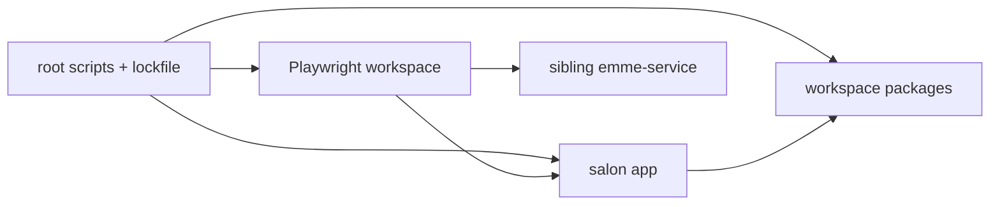

# Bun Workspace and Toolchain

## Workspace responsibilities

| Area | Owner |
|---|---|
| Root scripts and lockfile | Repository root |
| Application composition | `apps/emme-salon-app` |
| HTTP transport | `packages/api-client` |
| Typed boundary models | `packages/contracts` |
| Reusable UI | `packages/ui` |
| Validation | `packages/validation` |
| Browser journeys | `e2e/src` |

## Rules

- `bun.lock` is authoritative; CI uses `bun install --frozen-lockfile`.
- Root scripts MUST remain stable entry points for local and CI verification.
- Packages MUST expose only intentional public exports.
- Application-only dependencies belong to the application, not a shared package.
- Build output, test recordings, environment files, and credentials are ignored.
- Add a package only when it has a cohesive ownership and lifecycle boundary.



## Required commands

```bash
bun install --frozen-lockfile
bun run typecheck
bun run lint
bun run test
bun run build
```
