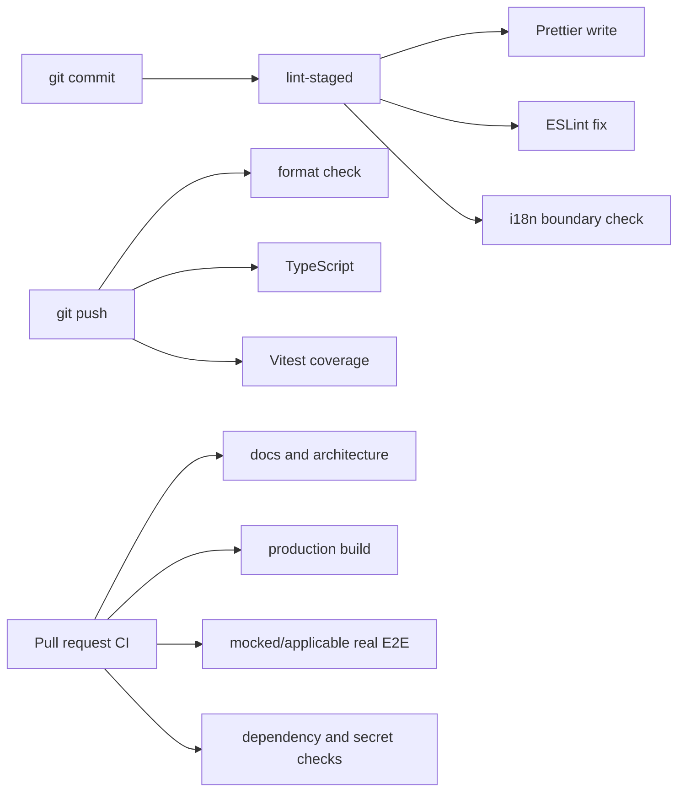
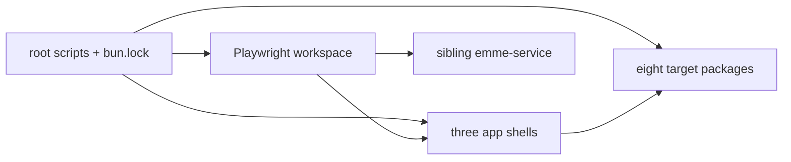

# Bun Workspace and Toolchain

> **Status: Updated.** Workspace/tooling guidance is retained; package ownership
> is reconciled with the canonical vertical-feature model.

## Workspace responsibilities

| Area | Owner |
| --- | --- |
| root scripts and lockfile | repository root |
| application composition | each `apps/*` shell |
| pure shared primitives | `packages/kernel` |
| generic UI and tokens | `packages/ui` |
| auth, tenancy, permissions, runtime | `packages/core` |
| shared localization runtime/catalogs | `packages/i18n` |
| abstract backend/transport contracts | `packages/api` |
| global HTTP, storage, provider adapters | `packages/infrastructure` |
| reusable vertical business behavior | `packages/features/src/<feature>` |
| deterministic shared test utilities | `packages/test-support` |
| browser journeys | root `e2e` |

The legacy `packages/domain`, `packages/application`, and
`packages/validation` directories are migration sources, not future ownership
destinations.

## Rules

- `bun.lock` is authoritative; CI uses `bun install --frozen-lockfile`.
- Root scripts remain stable entry points for local and CI verification.
- Mise tasks delegate to root scripts rather than create a second build path.
- Packages expose only intentional public exports.
- Application-only dependencies belong to an app, not a shared package.
- Build output, test recordings, environment files, and credentials are ignored.
- Add a package only for a cohesive ownership and lifecycle boundary.

## Local hooks and CI escalation



Prettier write commands may change staged files; validation commands are
non-mutating. Coverage begins with a measured floor and is ratcheted upward; it
does not replace critical browser journeys.



## Required commands

```bash
bun install --frozen-lockfile
bun run docs:check
bun run architecture:check
bun run typecheck
bun run lint
bun run test
bun run build
```
