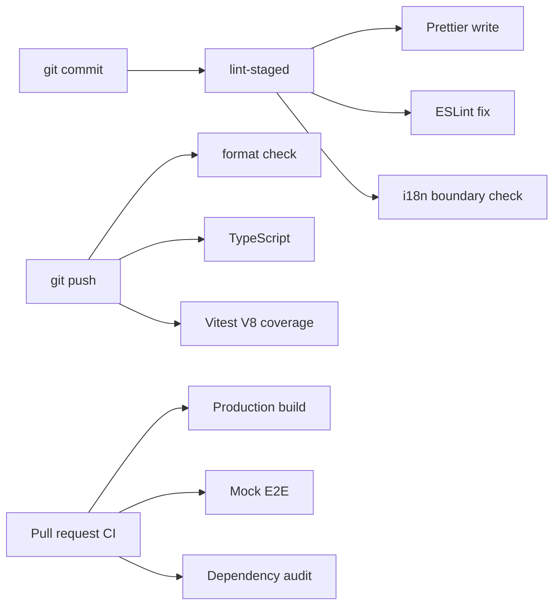
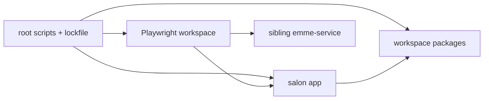

# Bun Workspace and Toolchain

## Workspace responsibilities

| Area                      | Owner                 |
| ------------------------- | --------------------- |
| Root scripts and lockfile | Repository root       |
| Application composition   | `apps/emme-salon-app` |
| HTTP transport            | `packages/api-client` |
| Typed boundary models     | `packages/contracts`  |
| Reusable UI               | `packages/ui`         |
| Validation                | `packages/validation` |
| Browser journeys          | `e2e/src`             |

## Rules

- `bun.lock` is authoritative; CI uses `bun install --frozen-lockfile`.
- Root scripts MUST remain stable entry points for local and CI verification.
- Mise task names MUST delegate to those same root scripts rather than create a
  second build implementation.

## Local hooks

The web repository uses Husky because its toolchain is already JavaScript/Bun
based. The hooks are intentionally tiered:



`spotlessApply` is a service-only Gradle formatter and does not belong in this
repository. Prettier write commands may change staged files; all validation
commands remain non-mutating.

Run `mise run hooks-install` after a clean checkout. Coverage uses a measured
initial floor and must be ratcheted upward; it is not a substitute for browser
journey coverage.

- Packages MUST expose only intentional public exports.
- Application-only dependencies belong to the application, not a shared package.
- Build output, test recordings, environment files, and credentials are ignored.
- Add a package only when it has a cohesive ownership and lifecycle boundary.



## Required commands

```bash
bun install --frozen-lockfile
bun run typecheck
bun run lint
bun run test
bun run build
```
