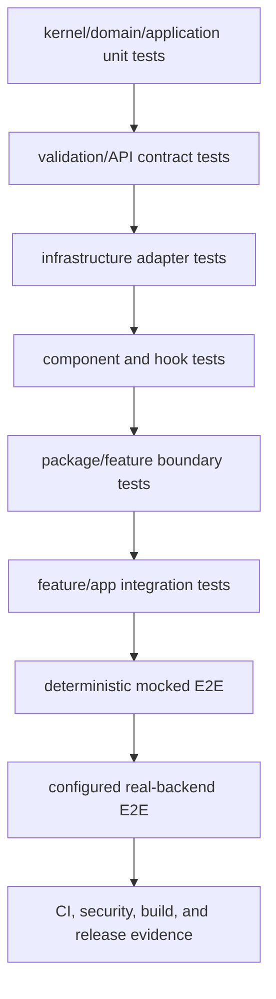

# Testing Architecture

Every implementation task follows Red → Green → Refactor → Verify. A task is
not complete without a focused failing test first, passing implementation,
refactoring under green tests, and applicable regression evidence.

## Test lanes and locations

The diagram shows increasing composition scope. A later lane does not replace
the earlier, smaller test that identifies the behavior or boundary.

| Layer | Location | Required behavior |
| --- | --- | --- |
| kernel/domain | colocated unit tests or feature `test/domain/` | rules, value objects, invariants, typed errors |
| application | colocated unit tests or feature `test/application/` | orchestration and protocol calls using fakes |
| validation | beside each `.schema.ts` | accepted, rejected, normalized, and boundary inputs |
| API | beside contracts/mappers | request/response shapes, parsing, pagination, errors, tenant context |
| infrastructure | beside each adapter | deterministic HTTP/storage/provider behavior, timeout, retry, redaction |
| presentation | component/hook directory | observable states, accessibility semantics, keyboard/focus behavior |
| package boundaries | `src/__tests__/` | exports, dependency direction, forbidden imports |
| feature integration | feature `__tests__/` | real feature composition with fake transport |
| app integration | app `src/__tests__/` | providers, routing, role permissions, tenant/session changes |
| browser | root `e2e/` | critical mocked and configured real-backend journeys |
| CI quality | workflows/scripts | typecheck, lint, docs, i18n, build, coverage, security, E2E |

## Deterministic doubles

- Unit tests never call real HTTP, browser storage, Google, payment, messaging,
  AI, or backend services.
- Protocol-based fakes expose explicit recorded calls, queued results, error
  injection, and reset behavior.
- Shared fakes with non-trivial behavior live in `@emme/test-support` and have
  their own tests; simple record-and-return fakes remain local.
- Time, randomness, locale, tenant, permissions, session, and request context
  are controlled.
- External SDK types are represented by minimal stubs at the owned boundary;
  tests do not mock private implementation paths in owned code.

## Required scenario matrix

Every module plan covers these scenarios when applicable:

- success and primary user outcome;
- empty state and boundary values;
- validation and malformed contract failure;
- transport failure, timeout, offline, and bounded retry;
- duplicate action or idempotency behavior;
- unauthorized, permission denied, and tenant mismatch;
- loading, stale-response, error, and recovery UI;
- session/tenant changes and cleanup/isolation;
- accessibility names, error association, keyboard, and focus behavior.

## Test-location checklist

- [ ] Pure rules and use cases are tested without React or network mocks.
- [ ] Every schema, mapper, and concrete adapter has boundary-focused tests.
- [ ] Components and hooks test observable behavior and accessibility.
- [ ] Public barrels and forbidden dependency directions have source-level
      boundary tests.
- [ ] Integration tests compose real package code with fake transport.
- [ ] Root E2E contains only critical workflows and identifies mock versus real
      providers.
- [ ] Tests are deterministic, isolated, parallel-safe, and contain no skipped
      or pending cases.
- [ ] The focused test, package suite, and applicable repository quality gates
      pass before completion.
