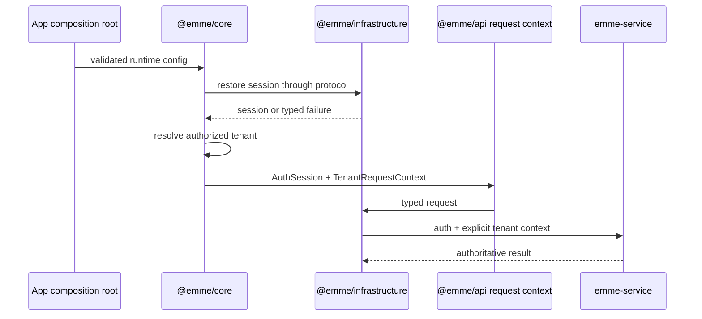
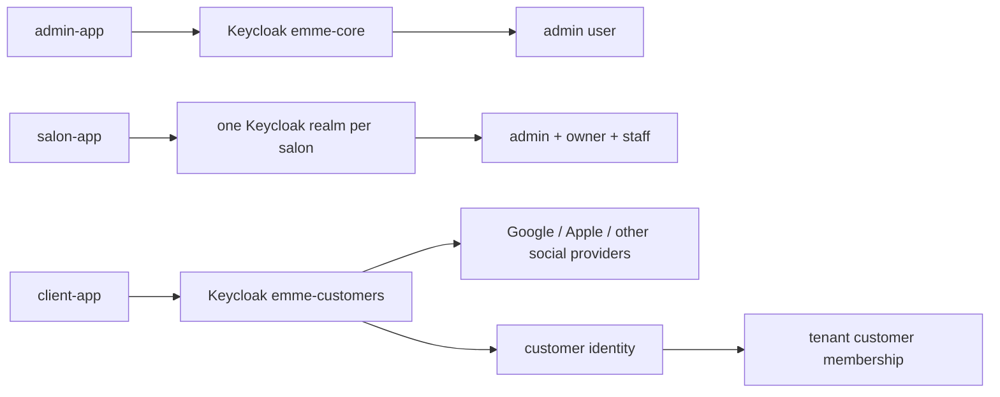

# Authentication and Tenancy

`@emme/core` owns session state and tenant-resolution contracts; `@emme/api`
owns auth-session and tenant request contracts; `@emme/infrastructure`
implements approved browser storage and HTTP attachment. Apps compose providers
at startup.

The invariant is explicit context: tenant identity comes from trusted session
and backend capabilities, never arbitrary component or URL input.

## Realm ownership

Authentication is split by security boundary, not by frontend package:

`emme-core` is the platform realm and has the global `admin` role. Each salon
realm is provisioned at runtime and receives an `admin` bootstrap account and
an `owner` bootstrap account; both have the `tenant_owner` capability for now.
Staff accounts use the narrower `tenant_staff` capability. The same username
in different realms is a different identity.

`emme-customers` is one shared realm configured once for social login. It is
not a shared salon data store: the backend creates or resolves a global
customer identity and records each salon relationship as a tenant-scoped
customer/membership row. A customer token is accepted only when its issuer is
the customer realm and its audience is `client-app`. Social-provider client
secrets are deployment-managed Keycloak configuration and never belong in the
frontend repository.

The `client-app` may use a tenant slug to select a salon before sign-in, but the
backend validates that context and the customer membership on every protected
operation. A slug is routing input, not authorization.

## Recovery behavior

| Condition | Required behavior |
| --- | --- |
| session loading | block protected workflow; render non-sensitive loading state |
| missing/expired/revoked session | clear protected caches and return to recoverable sign-in |
| no authorized tenant | render tenant-selection or no-access state |
| tenant switch | cancel/ignore stale work, clear tenant-scoped cache, rebuild request context |
| tenant mismatch response | discard response, normalize error, recover tenant context |
| storage unavailable | avoid silent persistence fallback; expose typed recoverable failure |
| logout | revoke/clear session, tenant, cache, and sensitive in-memory state |

Client guards improve UX only. Backend authorization and tenant isolation remain
mandatory for every request.

## Verification checklist

- [ ] Session restore, expiry, revocation, and logout cleanup are tested.
- [ ] Tenant selection, switch, mismatch, and stale-response handling are tested.
- [ ] Request context is explicit and cannot be derived from arbitrary UI state.
- [ ] Fake clocks, sessions, tenant stores, and transport keep tests deterministic.
- [ ] Protected data is absent from loading, denied, and recovery states.
