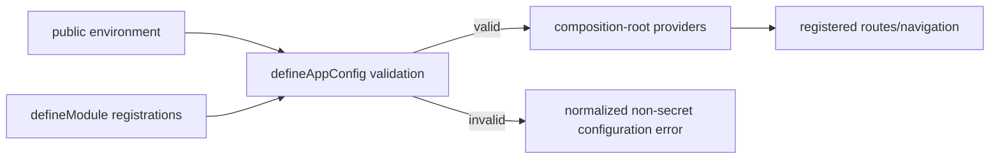

# Runtime and Module Configuration

`@emme/core` owns typed runtime configuration and module registration contracts.
Apps own concrete public environment mapping in `app-config.ts`. Every `VITE_*`
value is public; secrets and authorization policy remain server-side.

## `defineModule`

Each app shell defines its public runtime values and registers local routes and
providers. There is no shared product-feature module registry today; the salon
feature folders are ordinary app-local modules.

```ts
import { defineAppConfig } from '@emme/core';

export const salonAppConfig = defineAppConfig({
  id: 'salon-app',
  scope: 'tenant',
  api: { baseUrl: import.meta.env.VITE_API_BASE_URL },
});
```

The composition root creates concrete infrastructure and supplies it to core
providers. Salon features consume the resulting contexts and typed API hooks;
they do not instantiate browser or network dependencies.

## `defineAppConfig`

The app selects modules and wires public runtime configuration:

```ts
import { defineAppConfig } from '@emme/core';

import { analyticsModule } from '../features/analytics/module';
import { appointmentsModule } from '../features/appointments/module';
import { catalogModule } from '../features/catalog/module';
import { customersModule } from '../features/customers/module';

export const appConfig = defineAppConfig({
  id: 'emme-salon-app',
  api: {
    baseUrl: import.meta.env.VITE_API_BASE_URL,
    version: import.meta.env.VITE_API_VERSION,
  },
  observability: {
    environment: import.meta.env.VITE_APP_ENV,
    sentryDsn: import.meta.env.VITE_SENTRY_DSN,
  },
  modules: [
    appointmentsModule,
    catalogModule,
    customersModule,
    analyticsModule,
  ],
});
```

`defineAppConfig` validates required fields before protected routes render,
rejects duplicate module IDs, and exposes only typed public config. Concrete
HTTP, storage, auth, tenant, telemetry, and feature adapters are created by
`AppProviders.tsx` from this validated description.

## Startup flow



## Configuration checklist

- [ ] Required API origin, API version, environment, feature-flag, and
      observability values are validated.
- [ ] No private credential is present in `VITE_*` or generated browser config.
- [ ] Every app feature registers through `defineModule` and has a unique ID.
- [ ] Concrete dependencies are created in `AppProviders.tsx`, not modules.
- [ ] Valid, missing, malformed, duplicate-module, and environment-specific
      cases are tested.
- [ ] Invalid config disables dependent behavior safely and reveals no secrets.
