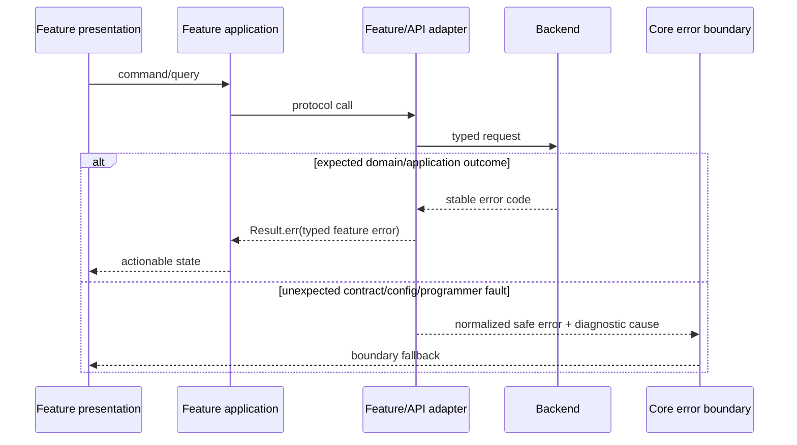

# Error Handling

Expected domain and application outcomes use `Result<T, E>` with typed feature
errors. Feature API/infrastructure maps transport and contract failures to
stable categories. `@emme/core` normalizes unexpected configuration/programmer
faults for error-boundary handling. Diagnostic causes are retained only for
safe telemetry.

| Failure | UI behavior | Retry rule |
| --- | --- | --- |
| client validation | field/message state | after correction |
| business conflict | refresh/reconcile state | only after state refresh |
| unauthorized | recoverable sign-in | after session recovery |
| forbidden | explicit access-denied state | no automatic retry |
| tenant mismatch | discard stale result and recover tenant | after context recovery |
| timeout/offline | unavailable state | bounded and safe/idempotent only |
| invalid contract/config/programmer fault | boundary fallback and safe telemetry | no blind retry |

Raw transport payloads, stack traces, tokens, and backend prose never become UI
copy. The UI translates stable error codes through the owning feature namespace.

## Error checklist

- [ ] Expected errors are typed and represented as `Result` values.
- [ ] Retry, duplicate-action, stale-response, and cancellation behavior is safe.
- [ ] Every category maps to an explicit, accessible UI state.
- [ ] Unknown failures reach an error boundary and retain a safe correlation ID.
- [ ] Tests assert normalization, redaction, telemetry shape, and recovery.
