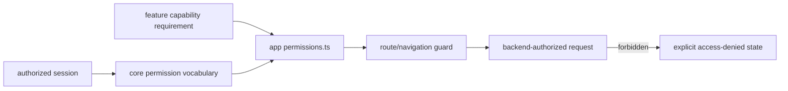

# Permissions

`@emme/core` owns frontend permission contracts, `useCan`, and
`PermissionGuard`. Features publish capability requirements; apps compose
role-specific routes and navigation. Backend enforcement is mandatory and
cannot be replaced by hidden routes or disabled controls.

Permission denial exposes no restricted payload and does not imply that a
hidden action is secure. Session/tenant changes recompute capabilities and
invalidate stale protected work.

## Permission checklist

- [ ] Every protected route/action names its required capability.
- [ ] Apps, not shared features, map roles to workflow visibility.
- [ ] Allowed, denied, changed-session, and tenant-mismatch behavior is tested.
- [ ] Backend contract tests prove server-side enforcement.
- [ ] Denied states are accessible and reveal no restricted information.
