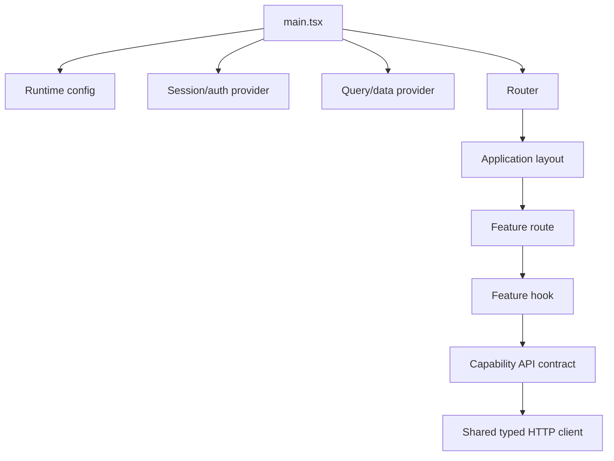

# Frontend Application

## Purpose

A frontend application owns the browser composition root: routing, providers, global layout, authentication/session bootstrapping, API clients, and feature composition.

## Reference layout

```text
apps/<application>/
├── src/
│   ├── app/                 # composition root, routes, providers
│   ├── features/            # user-facing capabilities, hooks, and view models
│   ├── modules/              # optional larger capability boundaries
│   ├── shared/               # deliberately reusable UI/platform code
│   ├── lib/                  # thin technical adapters
│   └── main.tsx
├── public/
├── vite.config.ts
└── package.json
```



## Rules

- The app shell owns routing and global providers.
- Features own user flows and feature-specific state.
- Shared code earns its place through reuse and stable semantics.
- Browser code calls feature hooks and capability API contracts, not ad hoc `fetch` calls scattered through components.
- Environment configuration is validated at startup and contains no secrets that must remain server-side.
- The frontend must not rely on internal backend packages; it consumes HTTP or generated contracts.

## App-shell guardrails

### FSD feature and capability API boundaries

Use Feature-Sliced Design for application-facing organization. Features own
their user flows, query hooks, view models, and UI mapping. The canonical
capability request adapters currently live in `@emme/contracts`; the shared
`@emme/api-client` package owns only transport behavior: authentication, tenant
headers, API-version headers, serialization, and Problem Details errors.

```text
features/
├── appointments/
│   ├── hooks/useAppointments.ts
│   └── components/
├── clients/
│   ├── hooks/useCustomers.ts
│   └── components/
└── services/
    ├── hooks/useServices.ts
    └── components/
```

`@emme/contracts` owns capability interfaces and adapters such as
`createAppointmentApi`, `createClientApi`, and `createServiceApi`. Feature hooks
may compose those adapters and map their results to UI models. UI components
must not depend on `HttpClient` directly. Do not place salon endpoint methods in
the reusable `@emme/api-client` package.

### Composition root

The app shell owns only cross-feature concerns:

```text
main.tsx
  → runtime configuration
  → error boundary
  → authentication/session provider
  → query/data provider
  → router
  → application layout
  → feature route
```

Feature business behavior remains in the feature/module boundary. Do not place API calls, tenant decisions, or feature-specific state in the global shell.

### Security and runtime configuration

- Treat all browser code and `VITE_*` variables as public.
- Keep tokens and sensitive state in the repository-approved secure session mechanism; never persist secrets in arbitrary local storage.
- Enforce authorization on the backend; frontend guards improve UX but are not security controls.
- Validate runtime configuration before rendering protected routes.
- Define safe behavior for expired sessions, tenant changes, unauthorized routes, and backend unavailability.

### Application checklist

- [ ] Routes have authenticated/anonymous and tenant-scope behavior defined.
- [ ] Global error, loading, offline, and session-expiry states are handled.
- [ ] API clients are typed and centralized.
- [ ] Browser-exposed configuration contains no secrets.
- [ ] Accessibility and performance budgets are part of CI.
- [ ] Production source maps, logging, and telemetry follow the security policy.
