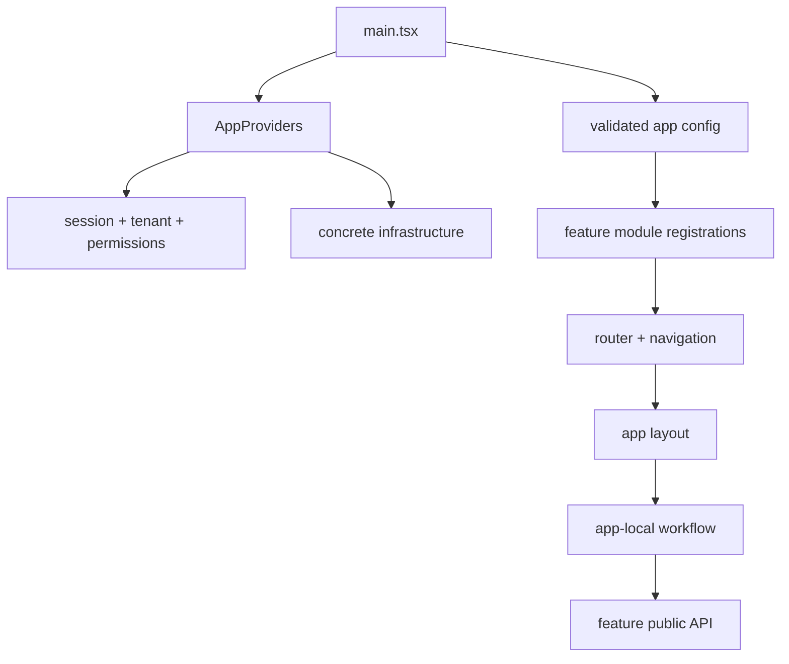

# Frontend Application

> **Status: Updated.** The detailed composition guidance is retained and uses
> vertical feature public APIs instead of global business packages.

An app owns the browser composition root: validated config, routing, providers,
global layout, session/tenant bootstrapping, concrete infrastructure, selected
feature modules, and role-specific workflows.

## Reference layout

```text
apps/<app>/src/
├── app/
│   ├── App.tsx
│   ├── AppProviders.tsx
│   ├── app-config.ts
│   ├── router.tsx
│   ├── routes/
│   ├── layouts/
│   └── error-boundary/
├── features/
├── config/
├── theme/
└── main.tsx
```



## Rules

- The shell owns only cross-feature concerns and concrete dependency wiring.
- App features own routes, pages, forms/filters, role workflows, and local state.
- Browser code calls feature capabilities; components do not call raw `fetch`.
- Shared code earns extraction through stable semantics and demonstrated reuse.
- Public runtime configuration is validated before protected routes render.
- No app imports backend internals, package source paths, or another app.

## Composition order

```text
main.tsx
  -> defineAppConfig validation
  -> error boundary
  -> authentication/session provider
  -> tenant provider
  -> permission/feature-flag providers
  -> data/query and i18n providers
  -> registered router/layout
  -> app workflow
  -> selected feature public API
```

See [app shell structure](../00-project/app-shell-structure.md) for all three
workflow trees and [runtime configuration](../01-runtime/configuration.md) for
module registration examples.

## Application checklist

- [ ] Authenticated/anonymous, tenant, permission, lazy, and not-found routes are
      defined and tested.
- [ ] Global loading, offline, session-expiry, and error fallback are accessible.
- [ ] Concrete network/storage/provider dependencies exist only in the
      composition root.
- [ ] Browser-exposed config contains no secrets.
- [ ] Every app feature has standard route/navigation/permission/module files.
- [ ] Accessibility, performance, source maps, logs, and telemetry follow policy.
