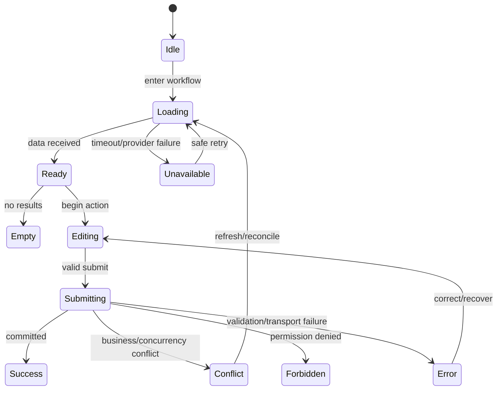

# Frontend Feature

> **Status: Updated.** Product feature presentation, hooks, and workflows are
> salon-app local; framework-free reusable behavior belongs in `@emme/business`.

A feature delivers one coherent user outcome, such as booking an appointment,
managing availability, or reviewing an audit timeline.

## State contract

## Rules

- Begin with the user outcome and make the ownership boundary visible.
- Keep server, URL, workflow, form, and transient UI state distinct.
- Validate at the UI edge while preserving backend validation as authoritative.
- Preserve stable error categories for validation, conflict, permission, tenant,
  and availability behavior.
- Prevent duplicate mutations or rely on an explicit idempotency contract.
- Cancel or ignore stale requests when route, session, or tenant context changes.
- Define rollback before enabling optimistic UI.
- Keep sensitive values out of URLs, logs, analytics, and persisted caches.
- Test keyboard, focus, screen-reader names, error association, and reduced
  motion for interactive flows.

## Ownership split

| Concern | Owner |
| --- | --- |
| reusable policy/use case/contract | capability in `@emme/business` |
| salon component/hook/page/workflow | `apps/salon-app/src/features/<feature>` |
| shared authentication gate | `@emme/auth`; login pages remain app-local |
| role page, route, form, filter, multi-step orchestration | app workflow |
| generic visual primitive | `@emme/ui` |
| auth/tenant/permission/runtime | `@emme/core` |
| concrete global browser/provider behavior | `@emme/infrastructure` |

## Feature checklist

- [ ] Primary, empty, loading, validation, conflict, forbidden, unavailable, and
      success states exist.
- [ ] Duplicate submit and stale response behavior is safe.
- [ ] Server truth wins over optimistic or cached state.
- [ ] No private feature path or raw transport is imported.
- [ ] Sensitive data is absent from telemetry and URLs.
- [ ] User-visible accessibility and recovery behavior is tested.
