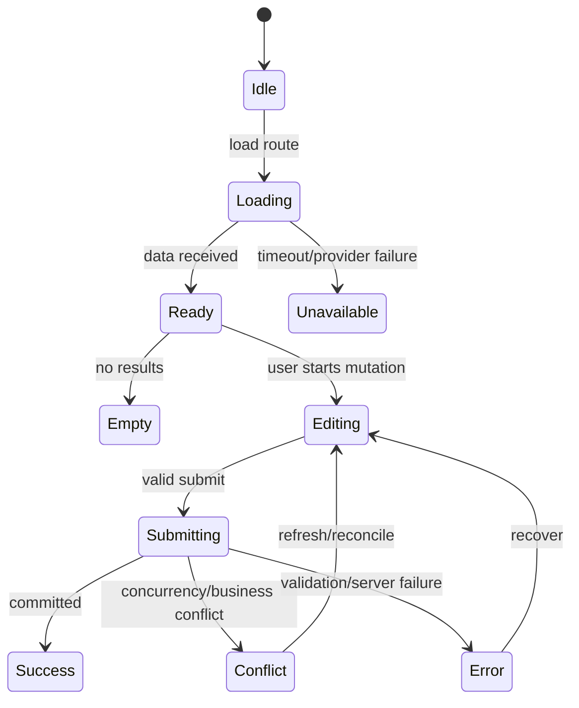

# Frontend Feature

## Purpose

A feature is a user-facing slice that delivers one coherent outcome, such as booking an appointment, managing customers, or reviewing notifications.

## Feature structure

```text
features/booking/
├── BookingPage.tsx
├── booking.routes.tsx
├── booking.api.ts
├── booking.types.ts
├── components/
├── hooks/
└── __tests__/
```



## Feature rules

- Start from the user outcome and keep the feature boundary visible.
- Keep server state, UI state, and form state distinct.
- Validate user input at the edge and preserve server validation as authoritative.
- Represent loading, empty, error, and success states explicitly.
- Keep mutations idempotent where retries or double submits are possible.
- Prefer composition over a feature-wide component with many boolean props.
- Add a focused test for the primary flow and error states.

## Feature state contract

Document the feature as a state machine rather than only a component tree:

```text
idle → loading → ready
                 ├── empty
                 ├── editing → submitting → success
                 │                         └── conflict/error
                 └── unavailable/retry
```

Rules:

- Prevent duplicate mutations while a command is pending, or make the command idempotent.
- Preserve server error codes so the UI can distinguish validation, conflict, authorization, and availability failures.
- Cancel or ignore stale requests when route parameters or selected tenants change.
- Define optimistic-update rollback behavior before enabling optimistic UI.
- Keep sensitive data out of URLs, analytics events, browser logs, and persisted caches.
- Test keyboard, focus, screen-reader name, error association, and reduced-motion behavior for interactive flows.

### Feature checklist

- [ ] Primary, empty, loading, validation, conflict, unauthorized, and unavailable states exist.
- [ ] Duplicate submit and stale response behavior is safe.
- [ ] Server truth wins over optimistic or cached state.
- [ ] Sensitive data is not exposed in client telemetry or URLs.
- [ ] User-visible accessibility and error behavior is tested.
