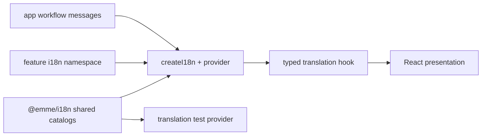

# Frontend Internationalization

> **Status: Updated.** Shared runtime/catalog detail is retained while reusable
> feature namespaces and app-only workflow copy remain with their owners.

## Ownership

| Copy or capability | Owner |
| --- | --- |
| engine, locale detection, provider, common/navigation/error catalogs | `@emme/i18n` |
| reusable feature status/actions/errors | owning feature `i18n/` |
| one-app page/workflow/role copy | owning app feature |
| dates, times, currency, phone formatting | shared formatters with explicit locale/time zone |
| stable structural test selectors | test contract, separate from translation keys |

Every locale has the same leaf-key tree for its namespace. Translation keys
express user-facing intent, not API paths, persistence IDs, or test IDs.

## Rules

- Shared and feature JSX contain no ad hoc user-facing strings.
- Message keys use lower camel case grouped by capability.
- Completed outcomes use past-tense meaning; commands are action-oriented.
- Unknown backend error codes use a localized feature fallback.
- Explicit locale changes update document language and preserve error category.
- Tenant time zone and currency are runtime values, not tenant-specific code
  branches.
- Stable test IDs remain independent of copy and locale.

## CI and test checklist

- [ ] Every supported locale contains the same leaf keys.
- [ ] Feature namespaces register through the feature public API.
- [ ] App-only copy is not promoted into shared catalogs without reuse.
- [ ] Locale fallback and missing-message detection are tested.
- [ ] Date, time, number, currency, and phone formatting are locale-aware.
- [ ] `document.documentElement.lang` follows the active locale.
- [ ] `bun run i18n:check` passes.
