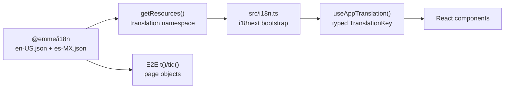
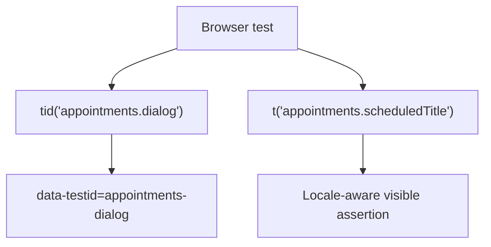

# Frontend internationalization

## Purpose

Internationalization is a frontend platform capability. User-facing copy is
owned by the shared `@emme/i18n` package, while React components consume that
catalog through the application translation adapter.

This keeps locale resources consistent between the application, page objects,
component tests, and browser flows.



## Resource contract

The canonical resources use one `translation` namespace with nested domain
groups:

```text
packages/i18n/src/
├── data/
│   ├── elements.json
│   └── translations/
│       ├── en-US.json
│       └── es-MX.json
├── index.ts
├── index.test.ts
└── validate.mjs
```

Each locale must have the same leaf-key tree. `validate.mjs` and the package
tests reject missing or extra keys. `TranslationKey` is derived from the
English catalog, so application code cannot invent arbitrary keys silently.

Groups represent user-facing ownership, not i18next namespaces:

| Group          | Responsibility                                |
| -------------- | --------------------------------------------- |
| `common`       | Shared actions, navigation, and global errors |
| `landing`      | Public entry screen                           |
| `auth`         | Authentication and tenant-selection copy      |
| `onboarding`   | First-run guidance                            |
| `dashboard`    | Overview and appointment status copy          |
| `appointments` | Scheduling workflows                          |
| `clients`      | Customer management                           |
| `services`     | Service catalog management                    |
| `finances`     | Financial overview                            |
| `settings`     | Workspace and preference management           |

## Application boundary

Components use `useAppTranslation()` rather than importing
`react-i18next` directly:

```tsx
const { t, i18n } = useAppTranslation();

return <Button>{t('common.save')}</Button>;
```

The adapter provides:

- typed nested keys;
- one application-level default namespace;
- a stable place for locale persistence and language changes;
- a boundary that can be tested without coupling feature code to i18next.

The bootstrap file `src/i18n.ts` is the only framework-specific wiring point.
It loads the shared resources, determines the initial locale, updates the
document language, and persists explicit user choices.

## Naming and key rules

- Use lower camel case for leaf keys: `monthlyGoalUpdated`.
- Group keys by capability: `appointments.cancelFailed`.
- Use past tense for completed outcomes: `client.created`.
- Use action-oriented names for commands: `common.save`.
- Keep technical identifiers out of visible copy.
- Do not use legacy `namespace:key` syntax; use `group.key` paths.
- Do not put user-facing English or Spanish strings directly in feature JSX.
- Do not use persistence, API, or test IDs as translation keys.

## Test IDs and translations

`elements.json` is an independent test contract. `tid()` resolves stable
selectors, while `t()` resolves visible copy. A test ID must remain stable when
copy changes or a locale is added.



## CI enforcement

The web quality pipeline runs:

```text
docs:check
→ i18n:check
→ format:check
→ typecheck
→ lint
→ unit/component tests
→ build
→ dependency audit
```

`i18n:check` validates both locale parity and source usage. It rejects direct
feature imports of `react-i18next` and legacy namespace keys. The application
adapter and bootstrap remain explicit exceptions because they define the
framework boundary itself.

## Definition of done

- [ ] Both supported locales contain the same leaf keys.
- [ ] New visible copy is added to every locale before UI code is merged.
- [ ] Components consume the typed application adapter.
- [ ] Tests use stable element IDs for structure and translated text only for
      user-visible behavior.
- [ ] Locale selection updates `document.documentElement.lang`.
- [ ] `bun run i18n:check` passes.
