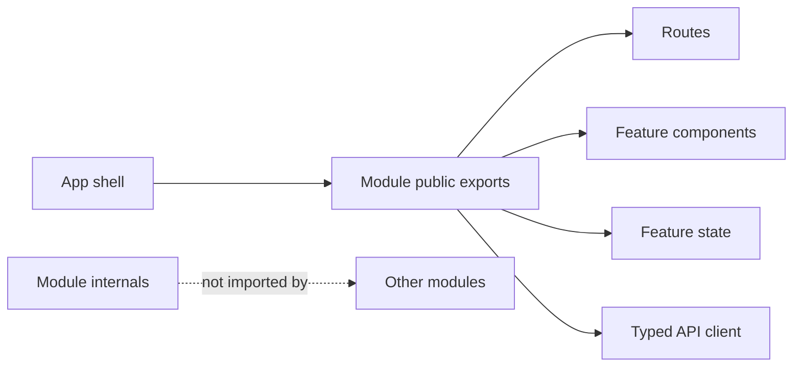

# Frontend Module

## Purpose

A frontend module is a cohesive product capability that may contain routes, components, state, data access, and tests. It is organized around what users do rather than around technical file types.

## Module shape

```text
src/modules/<capability>/
├── routes/
├── components/
├── state/
├── api/
├── model/
└── __tests__/
```

Use `features/` when the code is a focused user flow and `modules/` when it is a larger capability with multiple flows. Do not create both layers by default.



## Boundary rules

- A module owns its feature state and API mapping.
- Cross-module imports use public exports only.
- Shared UI primitives live in a platform/shared area; business-specific components stay with their module.
- API types are generated or centrally defined, then adapted to view models where necessary.
- A module should be removable without leaving unrelated imports throughout the app.

## Frontend module boundary

Each frontend module records:

| Concern | Required decision |
|---|---|
| Owner | Team and product capability |
| Routes | Public/protected routes and deep-link behavior |
| State | Server cache, form state, local UI state, persistence policy |
| API | Endpoints, schemas, auth/tenant requirements, error codes |
| Security | Role/permission UX and backend authority |
| Performance | Bundle, render, network, and interaction budgets |
| Testing | Unit, component, integration, and E2E coverage |
| Removal | Public exports and dependency cleanup plan |

### Boundary enforcement

- Export only deliberate public module APIs from an index/barrel.
- Do not import another module's internal components, hooks, stores, or API implementation.
- Keep route-level code thin and delegate to feature components.
- Keep cross-module UI workflows coordinated by the app shell or an explicit orchestration feature.
- Treat generated API types as transport contracts, not automatically as view models.

### Module checklist

- [ ] Public exports are explicit and internal imports are rejected by lint/tests.
- [ ] Loading, empty, error, unauthorized, and success states are defined.
- [ ] State ownership and cache invalidation are documented.
- [ ] Bundle/performance impact is measured for substantial features.
- [ ] The module can be tested without booting unrelated features.
