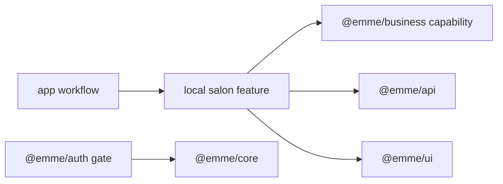

# Frontend Module

> **Status: Updated.** A reusable module is now a complete vertical feature,
> not an app `modules/` technical grouping.

A module is a cohesive business capability organized around user outcomes. The
current product modules live under `apps/salon-app/src/features`. Their
framework-free rules and use cases may be consumed from
`packages/business/src/<capability>`. `@emme/auth` provides the shared auth
gate, while each app owns its login and tenant-selection presentation.

## Boundary record

| Concern | Required decision |
| --- | --- |
| owner | business capability and responsible plan |
| public exports | stable contracts, factories, types, presentation |
| app consumers | which app workflows compose the capability |
| state | server, URL, workflow, local, and persistence ownership |
| API | contracts, schemas, tenant/auth requirements, error codes |
| dependencies | allowed packages/features and injected ports |
| testing | domain through E2E locations and scenario matrix |
| removal | consumer migration and export cleanup sequence |

## Rules

- Cross-feature imports use local public exports only.
- Generated API types are transport contracts, not automatic domain/view models.
- Route-level code stays thin and delegates to app workflows and feature APIs.
- Cross-feature workflows are coordinated by an app or explicit orchestration
  feature, never private imports.
- A module is independently testable through protocol fakes.
- Shared login presentation is intentionally app-local; only the auth gate
  primitive is shared.

## Module checklist

- [ ] Public exports are explicit and deep imports are rejected.
- [ ] All Hexagonal layers and ownership decisions are represented.
- [ ] State and cache invalidation have one authoritative owner.
- [ ] Loading, empty, error, forbidden, and success states are defined.
- [ ] The module tests without booting unrelated features or apps.
- [ ] App routes and role workflows are absent from reusable modules.
