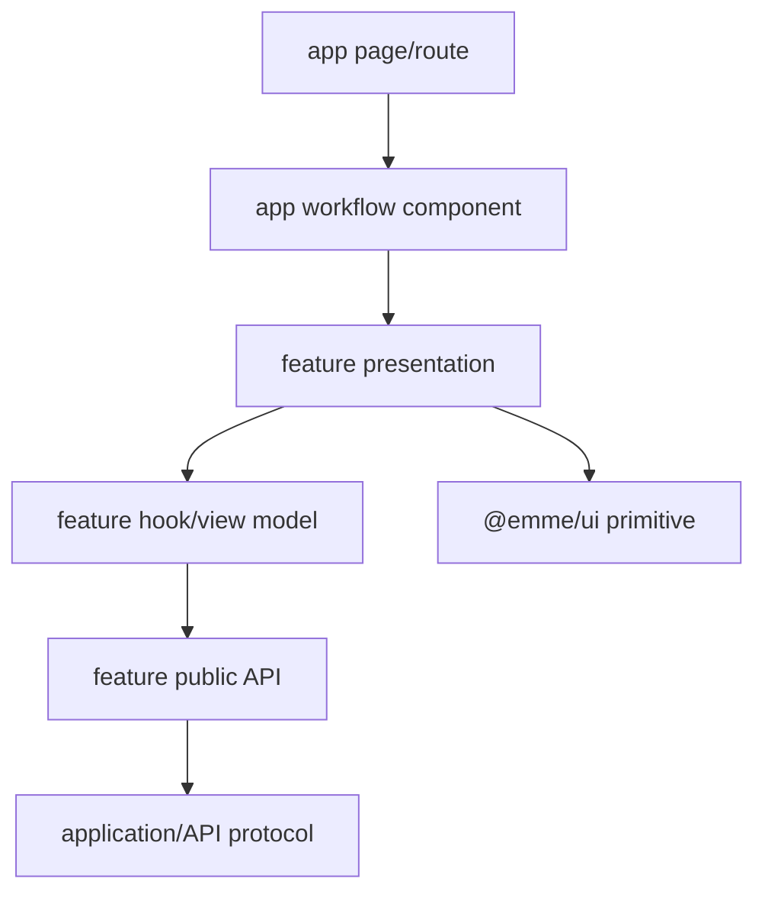

# React Boundary

> **Status: Updated.** React remains in app shells, core runtime providers, and
> feature presentation. Kernel, feature domain/application, API contracts, and
> infrastructure protocols are React-free.

## Rules

- Components focus on rendering and interaction orchestration.
- Business decisions remain in feature domain/application behavior, not JSX.
- Effects are explicit, cancelable, and cleaned up on route/session/tenant
  changes; derive values during render when possible.
- Server, URL, workflow, form, and local state follow the state ownership page.
- Accessibility semantics, keyboard behavior, focus, and reduced motion are
  component contracts.
- Untrusted rich content and URLs are sanitized/validated.
- Tokens, personal data, and provider payloads stay out of browser logs and
  telemetry.
- Large routes/capabilities are lazy-loaded; lists paginate or virtualize only
  when measurement justifies it.

## React checklist

- [ ] Loading, empty, error, forbidden, and success render states are explicit.
- [ ] Async cancellation and stale-response behavior is tested.
- [ ] Backend authorization remains authoritative.
- [ ] State ownership avoids unnecessary global stores and re-renders.
- [ ] Keyboard/focus/semantic behavior is tested with user-observable queries.
- [ ] Bundle, interaction, and render budgets are measured for substantial work.
