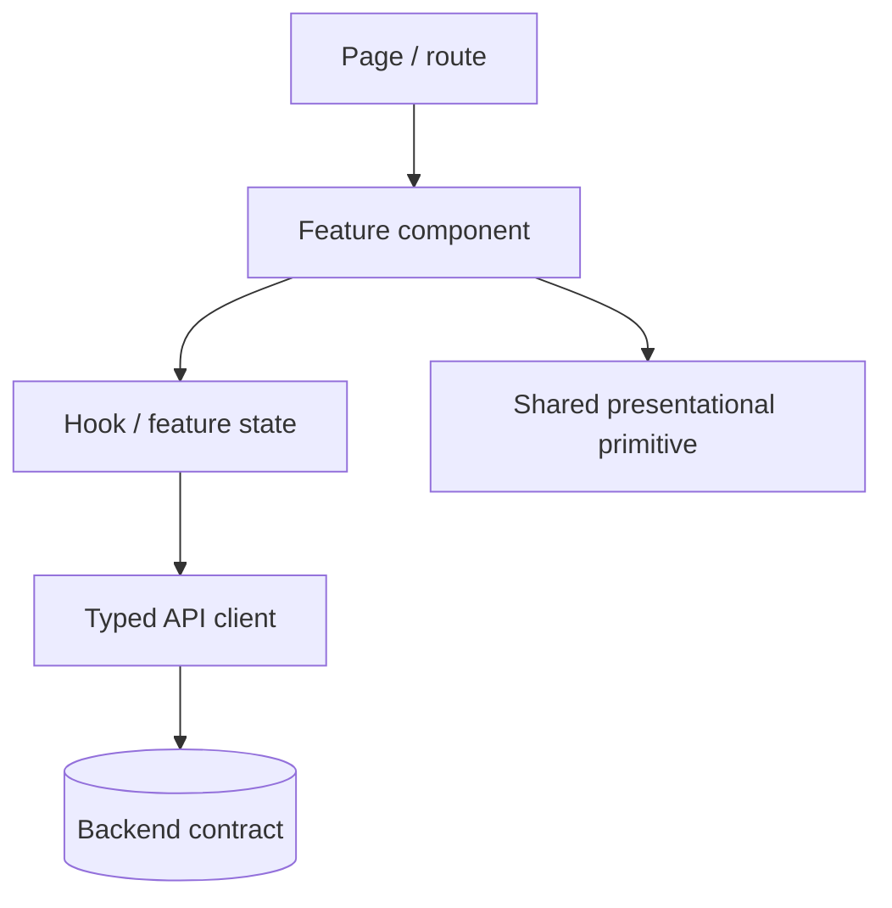

# React

## Component boundaries

```text
page / route
    ↓ composes
feature components
    ↓ use
hooks and typed API clients
    ↓ render
shared presentational primitives
```



## Rules

- Keep components focused on rendering and interaction orchestration.
- Keep domain decisions in feature/application hooks or pure functions, not duplicated in JSX.
- Keep effects explicit and cancelable where requests can outlive a component.
- Use stable keys and predictable state transitions.
- Make error and empty states first-class UI states.
- Keep accessibility semantics and keyboard behavior part of component contracts.
- Avoid global state for state that belongs to one route or feature.

## State ownership

| State | Owner |
|---|---|
| Route/query parameters | Router/app shell |
| Auth/session | App shell/session module |
| Server cache | Data-access layer |
| Form draft | Feature/form component |
| Cross-feature preference | Explicit shared store |
| Pure business calculation | Feature/domain function |

## Component and data guardrails

### Data and side effects

- Use one approved data-access/cache strategy per application.
- Give queries stable keys, bounded parameters, and explicit invalidation rules.
- Handle aborts, stale responses, retries, and offline transitions deliberately.
- Keep mutations aligned with backend idempotency and concurrency semantics.
- Avoid effects that synchronize state redundantly; derive values during render when possible.

### Security and privacy

- Render authorization-aware UI, but rely on backend authorization for enforcement.
- Escape or sanitize untrusted rich content before rendering.
- Do not inject arbitrary HTML or interpolate untrusted values into URLs without validation.
- Do not expose tokens, personal data, or provider responses in client telemetry.

### Performance

- Measure route-level bundle size, initial load, interaction latency, and render cost.
- Lazy-load large routes and optional capabilities.
- Virtualize genuinely large lists and paginate server data.
- Avoid global state updates that re-render unrelated feature trees.

### React checklist

- [ ] Async states and cancellation are tested.
- [ ] Backend authorization remains authoritative.
- [ ] Untrusted content is safely rendered.
- [ ] State ownership avoids unnecessary global stores.
- [ ] Performance budgets and critical-user-flow metrics are tracked.
