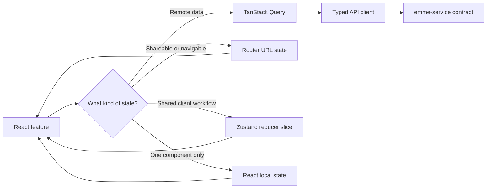

# Frontend State Management

The web application uses an explicit state-ownership model. Each state category
has one source of truth, a defined lifetime, and a deliberately small API.

## Decision

| State category | Owner | Examples | Do not use |
|---|---|---|---|
| Remote/server state | TanStack Query | appointments, customers, services, payments, notifications | Zustand copies of API collections |
| URL state | Router | calendar date, view, search, filters, pagination | hidden component or global state |
| Shared client workflow state | Zustand slice with reducer-style actions | onboarding completion, sidebar visibility, checkout step, selected appointment | Redux or a single global god-store |
| Local interaction state | React `useState` / `useReducer` | dialog open, draft form values, temporary validation state | global persistence |
| Derived state | Selectors or pure functions | totals, visible appointments, permission checks | duplicated mutable state |



The rule is simple: the browser must not maintain a second authoritative copy
of data owned by the service. TanStack Query owns fetching, caching, request
status, retries, and invalidation. Zustand coordinates client-only state that
must survive across multiple components or routes.

## Resource templates

Feature hooks retain their domain-specific request and response types while
sharing the lifecycle wiring through `src/api/queryFactory.ts`.

```ts
const appointmentsContract = createAppointmentApi(http);

const appointmentsResource = createQueryResource<
  undefined,
  Appointment[],
  'appointments'
>({
  key: 'appointments',
  queryKey: () => ['appointments', 'list'],
  queryFn: () => appointmentsContract.list(),
});

const createAppointment = createMutationOptions(
  {
    key: 'appointments',
    mutationFn: (input: CreateAppointment) => appointmentsContract.create(input),
  },
  queryClient,
);
```

The template standardizes:

- stable resource keys;
- typed query parameters, responses, and mutation variables;
- capability-contract and feature-owned view mapping;
- invalidation of the affected resource after a successful mutation;
- propagation of API errors to the consuming feature.

The generic layer must not hide business meaning. If two endpoints have
different semantics, they keep separate feature hooks even when they share the
same query factory.

## Client reducers with Zustand

Zustand is the shared client-state mechanism for this application. Reducer-style
actions keep transitions explicit without requiring Redux's store ceremony,
middleware ecosystem, or a global event-log model.

```ts
type CalendarAction =
  | { type: 'setDate'; date: string }
  | { type: 'setView'; view: 'day' | 'week' | 'month' }
  | { type: 'selectAppointment'; appointmentId: string | null };

function reduceCalendarState(
  state: CalendarState,
  action: CalendarAction,
): CalendarState {
  switch (action.type) {
    case 'setDate':
      return { ...state, date: action.date };
    case 'setView':
      return { ...state, view: action.view };
    case 'selectAppointment':
      return { ...state, selectedAppointmentId: action.appointmentId };
  }
}
```

Persist only client preferences that should survive a reload, such as onboarding
completion. Do not persist access tokens, API responses, payment details, or
stale appointment data in a client store.

## Feature ownership matrix

| Feature | TanStack Query owns | URL state may own | Zustand/reducer may own | Local state may own |
|---|---|---|---|---|
| Appointments | appointment lists, details, create/cancel mutations | selected date, calendar view, filters | selected appointment shared by calendar and details, multi-step booking workflow | open dialog, unsaved form draft |
| Calendar | availability and appointment queries | date range, resource filters, view mode | cross-component selection or drag/resize interaction state | hover, resize preview, popover visibility |
| Payments | payment intents, payment history, provider status, mutation lifecycle | return/callback status when linkable | checkout step, confirmation state, retry intent | card-form draft and field errors; never raw card data in persistent state |
| Notifications | notification list, unread count, mark-read mutation | notification center filter | temporary panel visibility or optimistic presentation state | toast visibility and animation state |
| Customers/services | lists, details, create/update/delete mutations | search and filter parameters | only shared selection or multi-step workflow state | form drafts and dialogs |
| Integrations | connection status and authorization mutations | provider/callback error parameters | connect/disconnect workflow step | confirmation dialog state |

## Why not Redux here?

Redux Toolkit is a strong choice when the product needs a large shared state
graph, mandatory middleware, strict action logging, or organization-wide Redux
governance. The current application needs a few focused client slices and
already uses TanStack Query for remote state, so Redux would duplicate lifecycle
responsibilities and add ceremony without improving the boundary.

This is a scope decision, not a prohibition. If the application later requires
cross-slice event replay, mandatory middleware, or a broad audit trail of client
actions, the store boundary can be replaced behind feature hooks.

## Rules and anti-patterns

- Do not put `Appointment[]`, `Payment[]`, or other server collections in
  Zustand.
- Do not mirror TanStack Query loading, error, or cached data flags in Zustand.
- Do not use a global store to avoid passing a prop to one component.
- Keep reducers pure and return new state objects.
- Keep API request/response mapping in the feature API boundary.
- Keep query keys stable and include every parameter that changes the result.
- Invalidate or update affected queries after mutations; never rely on a stale
  client copy.
- Keep sensitive payment data out of logs, persistence, telemetry, and browser
  state that is not required by the payment provider.

## Review checklist

- [ ] The state has one authoritative owner.
- [ ] Remote data uses TanStack Query and typed feature hooks.
- [ ] URL-shareable state is represented by the router.
- [ ] Shared client transitions have typed reducer actions.
- [ ] Local drafts and transient interactions remain local.
- [ ] Mutations invalidate or update affected queries.
- [ ] Sensitive values are not persisted or logged.
