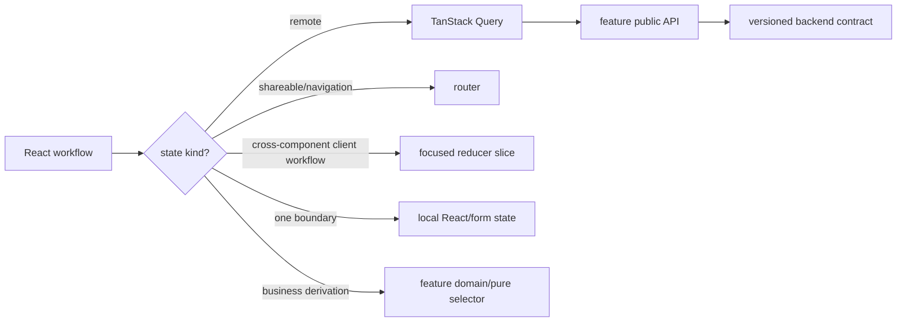

# Frontend State Management

> **Status: Updated.** The original state-ownership decision remains valid;
> feature resources now enter through vertical feature public APIs.

Each state category has one source of truth, lifetime, and deliberately small
API.

| State category | Owner | Examples | Do not use |
| --- | --- | --- | --- |
| remote/server | TanStack Query behind feature hooks | appointments, customers, services, payments | Zustand copies of API collections |
| URL | router/app workflow | calendar date/view, search, filters, pagination | hidden global/component state |
| shared client workflow | focused reducer-style Zustand slice when needed | onboarding step, sidebar, booking step, selected item | a global god-store |
| local interaction/form | React state/form boundary | dialog, draft, transient validation | unrelated global persistence |
| session/tenant/permissions | `@emme/core` | current session, trusted tenant, capabilities | arbitrary feature state |
| derived | selectors/pure functions/domain policy | totals, visibility, predicates | duplicated mutable state |



The browser never maintains a second authoritative copy of backend-owned data.
Query keys include tenant/session and every parameter that changes a result;
tenant/session changes cancel or reject stale work and invalidate protected
caches.

## Reducer-style workflow example

```ts
type BookingAction =
  | { type: 'selectService'; serviceId: string }
  | { type: 'selectDate'; date: string }
  | { type: 'selectSlot'; slotId: string }
  | { type: 'reset' };

function reduceBooking(state: BookingState, action: BookingAction): BookingState {
  switch (action.type) {
    case 'selectService':
      return { ...initialBookingState, serviceId: action.serviceId };
    case 'selectDate':
      return { ...state, date: action.date, slotId: null };
    case 'selectSlot':
      return { ...state, slotId: action.slotId };
    case 'reset':
      return initialBookingState;
  }
}
```

Persist only explicit non-sensitive preferences. Never persist access tokens,
API collections, payment details, or stale appointment data in a client store.

## State checklist

- [ ] State has one authoritative owner and bounded lifetime.
- [ ] Remote data uses query resources behind feature hooks.
- [ ] Shareable state is represented in the URL.
- [ ] Shared client transitions use typed actions; transient state remains local.
- [ ] Mutations invalidate/update affected queries and reject stale results.
- [ ] Tenant/session changes isolate protected data.
- [ ] Sensitive values are not persisted, logged, or sent to telemetry.
