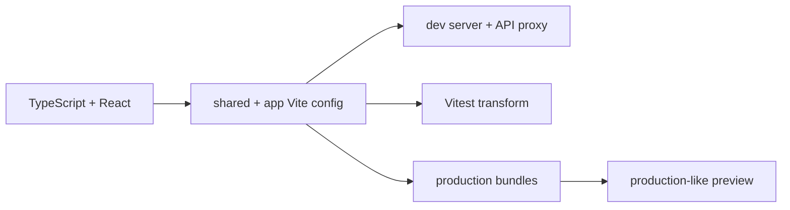

# Vite and Build Boundary

> **Status: Updated.** Detailed build/proxy guidance remains normative and is
> reconciled with package public-export boundaries.

Shared stable config belongs in `configs/vite`; app entries own identity and
public runtime needs. Aliases may not bypass package exports or point from a
package into an app.

## Rules

1. Keep Vite config small and composable.
2. Keep `VITE_API_BASE_URL` browser-safe and use server-only
   `API_PROXY_TARGET` for the local backend target.
3. Treat every browser-exposed environment variable as public.
4. Fail early for invalid app config without embedding secrets.
5. Keep Vite aliases, TypeScript paths, Vitest transforms, and export maps
   aligned.
6. Verify production builds and deep-link refresh behavior in CI/preview.
7. Pin/audit plugins and review post-install execution.
8. Define bundle/chunk budgets and source-map protection by release policy.

## Vite checklist

- [ ] `dev`, `test`, `build`, `preview`, and CI commands are deterministic.
- [ ] Public variables and local proxy behavior are validated and documented.
- [ ] `/api`, OAuth, and `/q` remain same-origin where required.
- [ ] Package aliases cannot deep-import or cross app boundaries.
- [ ] Preview verifies deep links, assets, cache headers, CSP, and error pages.
- [ ] Bundle, dependency, and production-build checks run in CI.
