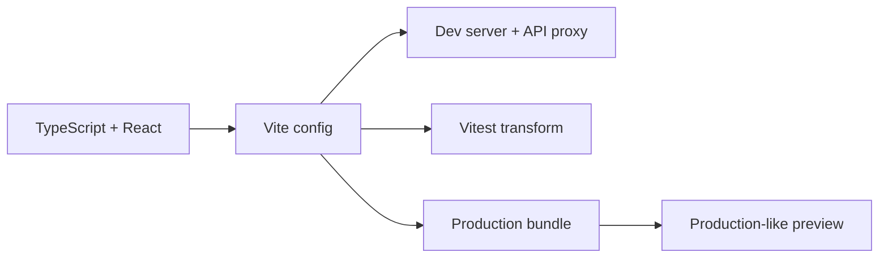

# Vite

## Purpose

Vite is the frontend development server and production bundler. It provides fast local feedback while keeping build configuration explicit and environment-aware.

## Responsibilities

- Resolve TypeScript and React modules.
- Provide development server behavior and proxy configuration.
- Build static production assets.
- Load only `VITE_*` values intended for browser exposure.
- Define test and coverage integration when the project uses Vitest.

## Rules

1. Keep the Vite config small and composable.
2. Proxy local API calls to the backend without embedding environment-specific URLs in components.
3. Treat all browser-exposed environment variables as public.
4. Fail early for missing required build-time configuration.
5. Keep aliases aligned with TypeScript compiler paths.
6. Verify production builds in CI, not only the dev server.

## Runtime configuration

If configuration must vary after the static bundle is built, use a deliberate runtime configuration endpoint or generated configuration file. Do not put private credentials in Vite environment variables.

## Build guardrails

- Keep lockfiles and the approved package manager version under version control.
- Fail CI on type errors, lint failures, dependency vulnerabilities, and production build failures.
- Keep aliases, TypeScript paths, test transforms, and Vite resolution aligned.
- Pin or audit third-party plugins; do not execute arbitrary post-install scripts without review.
- Generate source maps according to the production security policy and protect them if they reveal implementation details.
- Define bundle-size and chunk-size budgets for critical applications.
- Validate base paths, asset URLs, CSP, and cache headers in a production-like preview.

## Vite checklist

- [ ] `dev`, `test`, `build`, `preview`, and CI commands are deterministic.
- [ ] Public environment variables are validated and documented.
- [ ] API proxy behavior matches local authentication and CORS behavior.
- [ ] Production preview verifies deep links, refreshes, asset caching, and error pages.
- [ ] Bundle and dependency checks run in CI.
