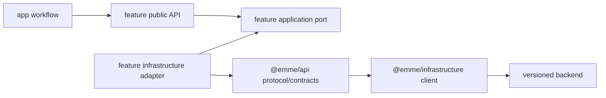

# API and Infrastructure

`@emme/api` defines abstract transport protocols, request context, contract
types, and safe API errors. `@emme/infrastructure` implements the concrete HTTP
client, retries, headers, session/tenant storage, telemetry, and provider
mechanics. A feature-specific repository adapter remains inside that feature
when it implements the feature's application port.

Transport failures map to typed unavailable, unauthorized, forbidden,
conflict, validation, tenant-mismatch, or contract errors. Business policy is
applied by feature domain/application code, never by a global transport client.

## Adapter checklist

- [ ] Concrete clients implement an injected protocol and contain no business policy.
- [ ] Feature repositories live with the feature whose ports they implement.
- [ ] Serialization, API-version/auth/tenant headers, parsing, timeout, retry,
      cancellation, and redaction are tested deterministically.
- [ ] Retries are bounded and limited to safe/idempotent requests.
- [ ] API and infrastructure packages do not import React or app internals.
