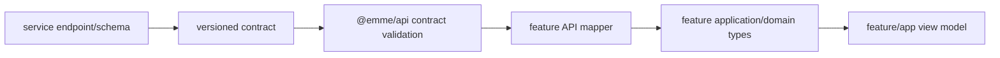
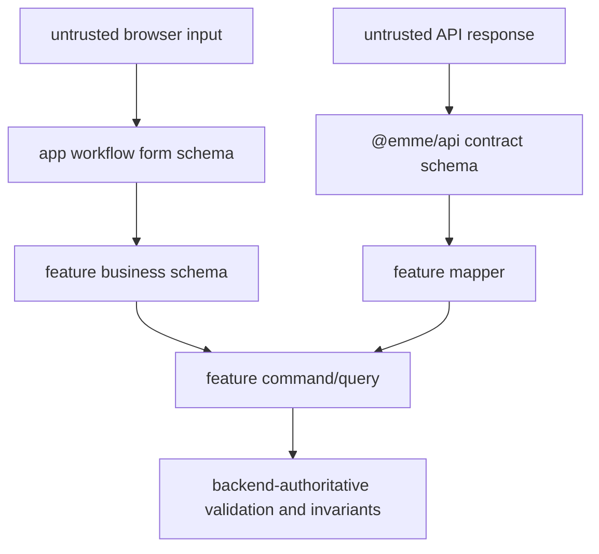

# Frontend Contract Consumption and Validation

> **Status: Updated.** The service remains the canonical contract owner;
> frontend validation is split by transport, business feature, and app workflow.

`emme-service` owns canonical HTTP/event contracts. `@emme/api` owns
version-aware transport protocols, envelopes, shared API errors, pagination,
tenant request context, contract schemas, and generated types. Features own the
queries, mutations, fragments, mappers, and capability contracts they use.

## Validation ownership

The layers are complementary: app schemas validate workflow shape, feature
schemas validate reusable business input, API schemas validate transport shape,
and the backend remains authoritative. The transitional global validation
package is not a target owner.

## Compatibility rules

- Do not import backend classes, entities, repositories, or generated internals.
- Keep transport DTOs separate from domain/view types when lifecycles differ.
- Unknown response fields are forward-compatible; missing required fields are
  explicit contract failures.
- Stable machine error codes map to feature errors and localized UI states; raw
  backend prose is diagnostic only.
- Tenant/auth context is explicit and validated before transport execution.
- Contract changes require provider and affected-consumer compatibility tests.

## Compatibility flow

1. Define the service contract change and compatibility window.
2. Add backward-compatible provider/consumer fixtures and tests.
3. Update `@emme/api` contracts and generated types.
4. Update affected feature schemas/mappers and app states.
5. Verify old and new versions during the window.
6. Remove deprecated fields only after every consumer migrates.

## Validation checklist

- [ ] Every untrusted input/response is validated at its owning boundary.
- [ ] API, business, and app schemas are not duplicated across global packages.
- [ ] Malformed, missing, extra, boundary, and normalized values are tested.
- [ ] Tenant/auth/API-version context is present in contract tests.
- [ ] Error codes map to typed feature errors and localized presentation.
- [ ] Provider and all affected consumers pass before deprecation removal.
