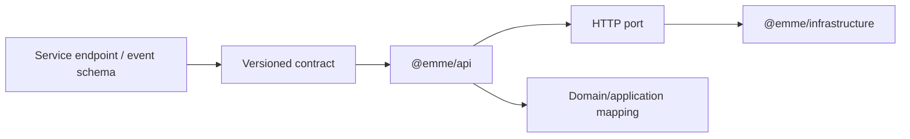

# Frontend Contract Consumption

## Contract ownership

`emme-service` owns the canonical HTTP and event contract. `emme-web` owns
transport-safe request/response adapters and browser-facing view models.

## Rules

- Do not import backend classes, entities, repositories, or generated internals.
- Keep transport DTOs separate from view state when their lifecycles differ.
- Map errors into stable user-safe categories; do not display raw server details.
- Treat unknown response fields as forward-compatible and missing required fields
  as explicit contract failures.
- Contract changes require provider tests and affected consumer verification.
- Never use browser persistence for access/refresh tokens unless an ADR documents
  the threat model and approved controls; prefer secure server-managed sessions.

## Compatibility flow

1. Define the service contract change.
2. Add backward-compatible consumer/provider tests.
3. Update `@emme/api` and adapters.
4. Verify old and new versions during the compatibility window.
5. Remove deprecated fields only after consumers migrate.
