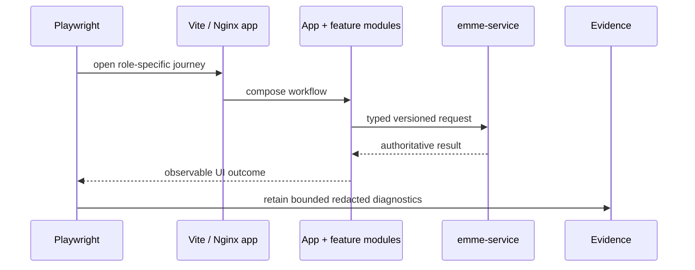
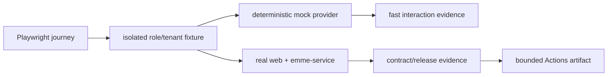

# Web End-to-End Architecture

> **Status: Updated.** Detailed mock/real lane and evidence policy is retained.

Playwright proves critical browser journeys across app composition and, in the
real lane, a running service. It does not replace unit, component, schema,
mapper, adapter, boundary, or contract tests.

## Mock and real lanes

| Lane | Backend | Credentials | Video archive | Purpose |
| --- | --- | --- | --- | --- |
| mock | protocol fixture/in-memory provider | none | local/failure policy only | deterministic UI and composition feedback |
| real | reachable `emme-service` at exact revision | protected disposable credentials | approved real workflow only | contract and release evidence |

Real runs declare exact web/service refs, target, base URLs, tenant identity,
and credential source. Compose is the disposable default; k3d/k3s are explicit
pre-provisioned targets. Mock artifacts never substitute for real evidence.

## Rules

- Use isolated synthetic users/tenants and clean up owned state.
- Use condition-based bounded waits, never fixed sleeps.
- Keep mock and real provider contracts behaviorally aligned.
- Do not commit or upload unredacted HAR files, tokens, cookies, response bodies,
  screenshots, traces, recordings, or local paths.
- Capture diagnostics according to the delivery policy and identify both source
  revisions for real evidence.

## Journey checklist

- [ ] Auth/session and trusted tenant context.
- [ ] One critical role-specific create/update/read outcome.
- [ ] Permission denial and tenant isolation.
- [ ] Loading, empty, validation, conflict, unavailable, offline, and retry.
- [ ] Duplicate action and stale-response safety.
- [ ] Responsive, keyboard, focus, and semantic behavior where applicable.
- [ ] Mocked and configured real lanes are deterministic in their declared scope.
