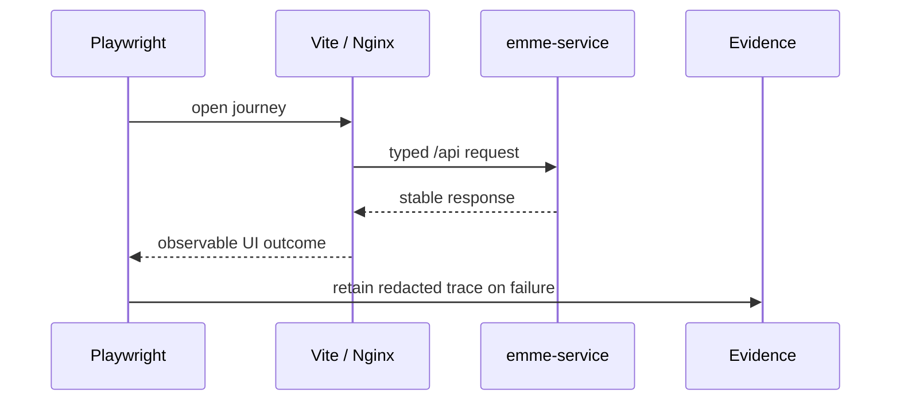

# Web End-to-End Architecture

## Scope

Playwright proves critical browser journeys across the web application and a
running service. It does not replace unit, component, or contract tests.

## Rules

- Real-stack tests MUST use exact web/service refs or immutable images.
- Mocked tests MUST be labeled and use protocol-level fixtures.
- Use synthetic isolated users/tenants and clean up owned state.
- Use condition-based bounded waits; never fixed sleeps.
- Do not commit HAR files, tokens, cookies, response bodies, or local paths.
- Capture diagnostics only on failure and redact before retention.

## Journey checklist

- [ ] Authentication and tenant selection.
- [ ] One critical create/update/read workflow.
- [ ] Authorization denial or tenant isolation.
- [ ] Loading, empty, error, offline, and retry states.
- [ ] Responsive/accessibility behavior where applicable.
