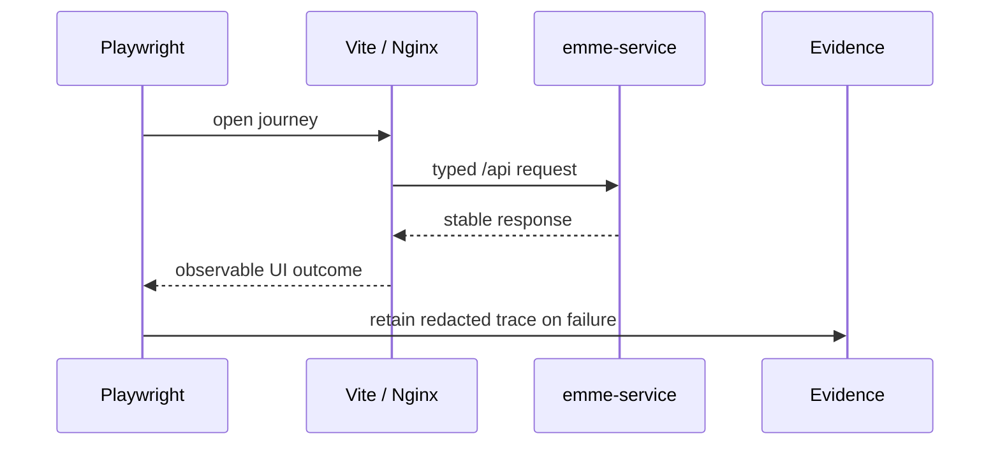
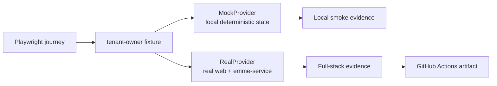
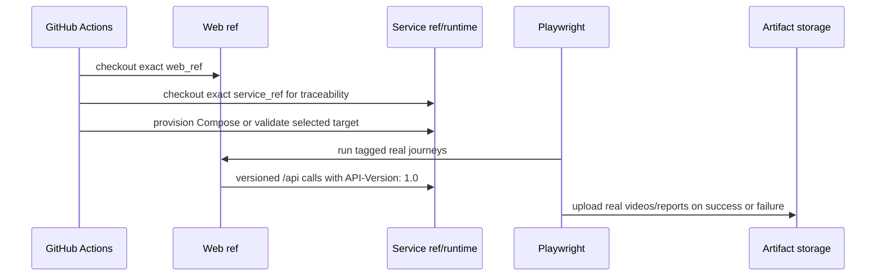

# Web End-to-End Architecture

## Scope

Playwright proves critical browser journeys across the web application and a
running service. It does not replace unit, component, or contract tests.

## Rules

- Real-stack tests MUST use exact web/service refs or immutable images.
- Mocked tests MUST be labeled and use protocol-level fixtures.
- Use synthetic isolated users/tenants and clean up owned state.
- Use condition-based bounded waits; never fixed sleeps.
- Do not commit HAR files, tokens, cookies, response bodies, or local paths.
- Capture diagnostics only on failure and redact before retention.

## Mock and real lanes

The browser contract is shared, but the providers are intentionally separate:

| Lane | Backend | Credentials | Video archive | Purpose |
|---|---|---|---|---|
| Mock | In-memory provider | None | Local only | Fast UI and interaction feedback |
| Real | Reachable `emme-service` | Actions secrets | Real workflow only | Tenant-owner contract and release evidence |

The reusable real workflow accepts `service_ref`, `web_ref`, `suite`,
`deployment_target`, and `runtime`. Compose is the default target: the workflow
builds the selected service image, starts PostgreSQL/Redis/Keycloak, runs the
typed provisioner, and starts the web ref locally. k3d and k3s are explicit
pre-provisioned targets and require both `service_base_url` and `web_base_url`.
The service ref is checked out beside the web repository so an artifact can be
traced to both source revisions.

Required real variables are `E2E_MODE=real`,
`E2E_BASE_URL`, `E2E_API_URL`, `E2E_KEYCLOAK_USERNAME`, and
`E2E_KEYCLOAK_PASSWORD`. Tokens and cookies must never be printed or uploaded.
`RECORD_DEMO=true` is reserved for the real recording suite. Mock commands
cannot enable CI video archival.

## Journey checklist

- [ ] Authentication and tenant selection.
- [ ] One critical create/update/read workflow.
- [ ] Authorization denial or tenant isolation.
- [ ] Loading, empty, error, offline, and retry states.
- [ ] Responsive/accessibility behavior where applicable.

## Evidence policy

Mock artifacts are not a substitute for the real evidence lane. Generated
recordings, traces, screenshots, tokens, cookies, and response bodies remain
ignored and untracked. Regression diagnostics may upload failure reports, but
only `suite=recordings` uploads the real full-stack video directory.
