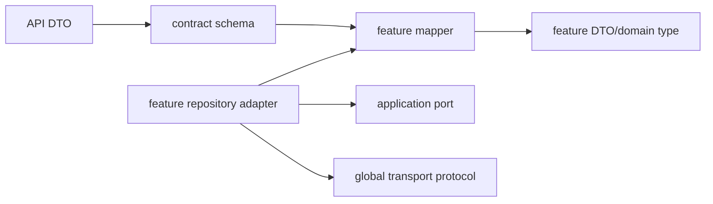

# Feature Adapters

Each feature owns its queries, mutations, fragments, mappers, and repository
implementations for its application ports. Global infrastructure supplies the
transport/provider mechanism; feature adapters supply feature-specific mapping.

Adapters preserve typed errors and require explicit tenant/auth request
context. They do not decide cancellation, booking, permission, payment, or
other business policy.

## Feature-adapter checklist

- [ ] Successful, empty, malformed, validation, conflict, permission, tenant
      mismatch, and retryable responses are mapped and tested.
- [ ] Transport naming such as `clientId` is translated at the mapper boundary.
- [ ] Raw DTOs and transport errors do not leak into domain or presentation.
- [ ] Application ports are injected and concrete adapters are composition-root
      registrations.
- [ ] Private GraphQL documents and mapper internals are not public exports.
