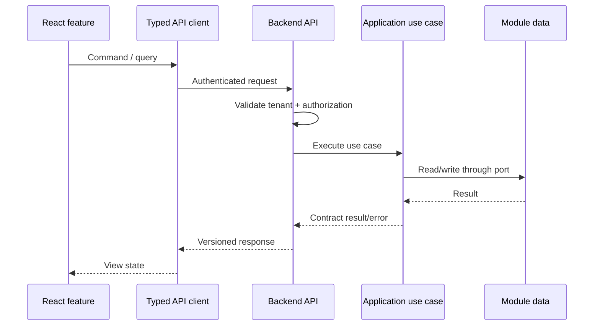
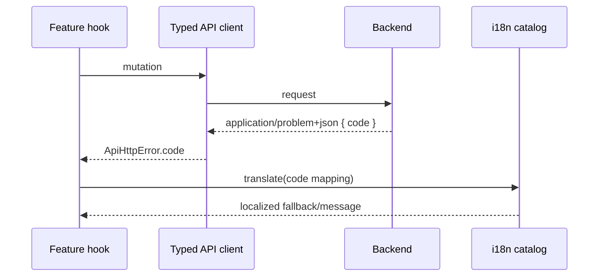

# Frontend–Backend Integration

## Purpose

The frontend and backend are independently structured applications joined by
explicit HTTP contracts. The service repository is the canonical contract owner;
this page defines the web consumer obligations. See the service-side
[integration contract](https://github.com/migangdelzar/emme-service/blob/main/docs/architecture/03-integration/frontend-backend.md)
for backend ownership and release policy.

## Request flow

```text
React feature
   ↓ typed API client
HTTP /api
   ↓ auth + tenant context
controller
   ↓ application use case
domain + infrastructure
```



## Consumer rules

- Consume versioned API routes through `@emme/api-client` and
  `@emme/contracts`.
- Keep `@emme/contracts` independent of `@emme/api-client`: contracts define
  transport types, routes, and minimal HTTP ports; the API client implements
  HTTP execution, authentication headers, tenant context, and Problem Details.
- Application features may adapt contract payloads into view models, but must
  not call `fetch` directly from feature components or hooks.
- Treat backend validation and authorization as authoritative.
- Define loading, empty, validation, conflict, unauthorized, and unavailable states in the frontend.
- Propagate correlation IDs for support and tracing.
- Keep backend error codes stable enough for frontend behavior; keep human messages replaceable.
- Add contract tests for high-value endpoints and E2E tests for critical journeys.

## Local development

- Vite proxies API requests to the local backend.
- The sibling service exposes the documented health endpoint.
- Authentication and tenant fixtures are deterministic for tests.
- CORS, cookie, and session behavior is tested in the same shape used by local development.

## Integration guardrails

### API consumption

- Keep OpenAPI/schema definitions with the backend contract owner.
- Preserve the dependency direction: feature adapter → contracts/API client →
  browser transport. The contracts package must never import the concrete API
  client package.
- Adapt transport types to feature view models where their lifecycles differ.
- Detect breaking schema changes in CI before deployment.
- Define maximum request/response sizes, pagination, timeout, and rate-limit behavior.

### Authentication and tenancy

- Use the repository-approved OAuth/session/token flow; never invent a parallel browser credential store.
- Propagate tenant identity from trusted claims/session context, not arbitrary client fields.
- Define behavior for expired tokens, revoked sessions, tenant switching, and insufficient permissions.
- Keep CORS, CSRF, cookie, and header policy consistent across local, CI, stage, and production.

### Failure and consistency

```text
frontend request
  → timeout / cancellation
  → typed success or stable error code
  → retry only safe/idempotent operations
  → user-visible recovery or support correlation
```

Document whether a successful mutation means committed state, accepted asynchronous work, or an intermediate status. The frontend must not display success when the backend has only accepted a request for later processing.

### Problem details and localized messages

The backend returns a structured Problem Details response when an operation
fails. The frontend preserves the machine-readable `code` and chooses the user
message from the active locale; backend prose is treated as diagnostic context,
not as presentation copy.



Calendar mappings currently include `CALENDAR_SYNC_CONFLICT`,
`GOOGLE_OAUTH_FAILED`, and `SHEETS_EXPORT_FAILED`. Unknown codes safely use the
feature fallback. Translation keys are present in every supported locale and
are validated by the i18n quality gate.

### Integration checklist

- [ ] Schema/client compatibility is checked before release.
- [ ] Auth, tenant, CORS/CSRF, and session expiry are tested end to end.
- [ ] Error codes map to explicit UI states.
- [ ] Retry/cancellation behavior does not duplicate mutations.
- [ ] Correlation IDs and safe diagnostics cross the boundary.
- [ ] Critical journeys run against production-like infrastructure.
