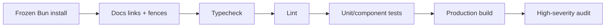

# Web Continuous Integration

## Required gates

Pull requests MUST run documentation validation, typecheck, lint, unit/component
tests, production build, and high-severity dependency audit. Mock Playwright
journeys remain an explicit local/manual workflow. The manual demo-recording
workflow runs deterministic mock flows and archives videos and reports for 14
days. Real-stack E2E and image smoke require coordinated service and deployment
environments and remain release-promotion gates.

The repository also runs `security-scan.yml` for Gitleaks and Bun audit. The
`dependency-review.yml` workflow is available for manual dispatch after GitHub
Dependency Graph is enabled for the repository. Any temporary allowlist is
documented in the [dependency risk register](../05-operations/dependency-risk-register.md)
with a compensating control and review date.

## Rules

- CI uses the repository lockfile and pinned action major versions.
- The fast test command MUST not silently require a running backend.
- Real E2E explicitly declares service ref, environment, and credentials source.
- CI logs MUST redact tokens, cookies, and sensitive request bodies.
- Cache keys include lockfile/toolchain identity.
- A warning-only lint policy MUST have a tracked reduction plan; new errors fail.
