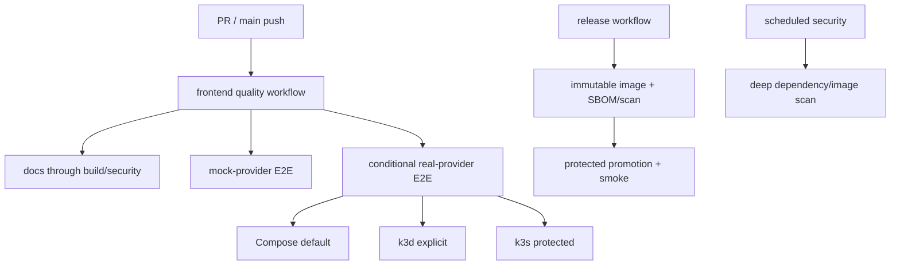

# Web CI and Regression Delivery

> **Status: Updated.** Detailed workflow responsibilities are retained and now
> include canonical handbook/index and architecture-boundary checks.

## Required gates

```mermaid
flowchart LR
    Install[Frozen Bun install] --> Docs[docs links/fences/index]
    Docs --> I18n[i18n validation]
    I18n --> Architecture[exports + forbidden imports]
    Architecture --> Types[typecheck]
    Types --> Lint[format/lint]
    Lint --> Unit[unit/component/contract tests]
    Unit --> Coverage[coverage]
    Coverage --> Build[production builds]
    Build --> Security[dependency/secret checks]
    Security --> MockE2E[mocked E2E]
    MockE2E --> RealE2E[configured real E2E]
```

Pull requests run all fast deterministic gates. Real E2E runs only with an
explicit service ref, environment/target, and protected credential source. The
real recording lane is serial and is the only lane allowed to archive approved
workflow videos.

## Rules

- CI uses `bun.lock`, frozen install, and pinned action major versions.
- `bun run docs:check` and the deterministic handbook index scan must pass.
- Architecture checks reject undeclared exports, private deep imports, global
  business ownership, app-to-app imports, and `@emme/test-support` production
  dependencies.
- Fast tests never silently require a running backend.
- Compose is the disposable real-E2E default; k3d/k3s require explicit URLs and
  immutable refs.
- Jobs redact tokens, cookies, private payloads, and sensitive recordings.
- Parallelize independent checks; serialize shared deployments/mutable data.
- A warning-only exception has an owner, scope, compensating control, expiry,
  and risk-register entry.

## Workflow responsibilities

## CI checklist

- [ ] Every required gate has one stable root command and failing exit status.
- [ ] All handbook pages are indexed and all relative links/fences resolve.
- [ ] No skipped test or unresolved architecture violation passes.
- [ ] Mock/real lanes identify provider, app, tenant, and source revisions.
- [ ] Artifacts and logs follow redaction/retention policy.
- [ ] Exceptions are time-bounded and visible in the risk register.
