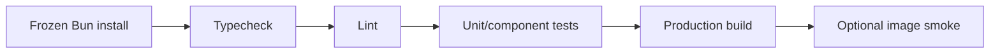

# Web Continuous Integration

## Required gates

Pull requests MUST run typecheck, lint, unit/component tests, and production
build. Image smoke and real-stack E2E run when their dependencies are available
and are release gates for production promotion.

## Rules

- CI uses the repository lockfile and pinned action major versions.
- The fast test command MUST not silently require a running backend.
- Real E2E explicitly declares service ref, environment, and credentials source.
- CI logs MUST redact tokens, cookies, and sensitive request bodies.
- Cache keys include lockfile/toolchain identity.
- A warning-only lint policy MUST have a tracked reduction plan; new errors fail.
