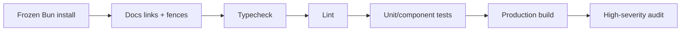
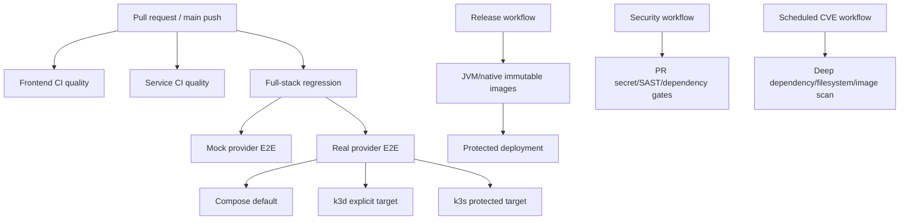

# Web CI and Regression Delivery

## Required gates

Pull requests MUST run documentation validation, typecheck, lint, unit/component
tests, production build, and high-severity dependency audit. The
`regression.yml` workflow runs the mock E2E lane independently and can run the
real lane against the default Compose target or an explicitly supplied k3d/k3s
environment. The real recording suite is serial and is the only lane allowed to
archive videos.

The repository also runs `security-scan.yml` for Gitleaks and Bun audit. The
`dependency-review.yml` workflow is available for manual dispatch after GitHub
Dependency Graph is enabled for the repository. Any temporary allowlist is
documented in the [dependency risk register](../05-operations/dependency-risk-register.md)
with a compensating control and review date.

## Rules

- CI uses the repository lockfile and pinned action major versions.
- The fast test command MUST not silently require a running backend.
- Real E2E explicitly declares service ref, environment, and credentials source.
- Compose is the default disposable target; k3d and k3s require explicit
  selection and pre-provisioned URLs.
- k3s production runs MUST use a protected GitHub Environment and immutable
  service/web revisions.
- Mock E2E diagnostics MAY retain failure screenshots/traces, but MUST NOT
  archive videos.
- Regression jobs should be parallel when they do not share a deployment or
  mutable test data.
- CI logs MUST redact tokens, cookies, and sensitive request bodies.
- Cache keys include lockfile/toolchain identity.
- A warning-only lint policy MUST have a tracked reduction plan; new errors fail.

## Workflow responsibilities

`ci-frontend.yml` and the service repository's unified backend CI remain the
repository-owned quality gates. `regression.yml` is the cross-repository
browser contract. `real-e2e-recordings.yml` is reusable by regression and
manual dispatch; its `suite` input selects either the full real suite or the
serial recording subset.
