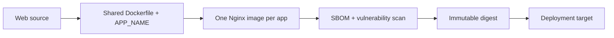

# Web Container

## Artifact

The production static images are published independently as:

```text
emme/admin-frontend
emme/salon-frontend
emme/client-frontend
```



## Rules

- Use a reproducible frozen lockfile and approved immutable base images.
- Use `deploy/docker/frontend.Dockerfile` for all three apps and pass one of
  `admin-app`, `salon-app`, or `client-app` as `APP_NAME`.
- Build in a separate stage from the minimal Nginx runtime; copy only the
  selected app's `dist/` output into the final image.
- Run the runtime as non-root and expose only required ports.
- Configure security headers and SPA fallback explicitly.
- Proxy `/api`, OAuth, and `/q` requests through Nginx to the configured
  `EMME_API_UPSTREAM`; never let authenticated API requests fall through to the
  SPA entry point.
- Disable Nginx response buffering and use a long read timeout for the
  dashboard SSE endpoint.
- Never embed secrets in the image or `VITE_*` values.
- Exclude `/api` from service-worker fallback/caching unless an approved design
  explicitly defines safe authenticated caching.
- Publish SBOM, scan result, source label, commit, version, and digest.

## Local build commands

```bash
bun run docker:build:admin
bun run docker:build:salon
bun run docker:build:client
```

## Verification

- [ ] Static assets and SPA routes load from the image.
- [ ] `/health` is available without exposing application data.
- [ ] API requests are not cached as static content.
- [ ] `EMME_API_UPSTREAM` resolves from the deployment network and Nginx config
      validation shows the expected proxy locations.
- [ ] Image scan and non-root checks pass.
