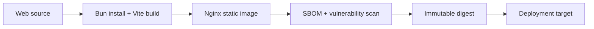

# Web Container

## Artifact

The production static image is published as:

```text
ghcr.io/migangdelzar/emme-web
```



## Rules

- Use a reproducible frozen lockfile and approved immutable base images.
- Build in a separate stage from the minimal Nginx runtime.
- Run the runtime as non-root and expose only required ports.
- Configure security headers and SPA fallback explicitly.
- Never embed secrets in the image or `VITE_*` values.
- Exclude `/api` from service-worker fallback/caching unless an approved design
  explicitly defines safe authenticated caching.
- Publish SBOM, scan result, source label, commit, version, and digest.

## Verification

- [ ] Static assets and SPA routes load from the image.
- [ ] `/health` is available without exposing application data.
- [ ] API requests are not cached as static content.
- [ ] Image scan and non-root checks pass.
