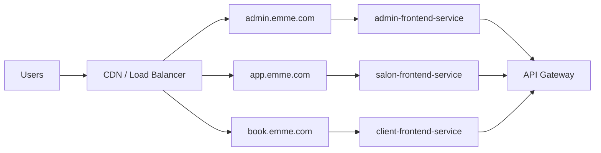

# Frontend Deployments

The monorepo produces three separate production artifacts from one shared
Dockerfile. Shared packages are compiled into the selected application; the
runtime image does not contain the other applications' static assets.



## Build matrix

| App directory | Package name | Build argument | Image | Deployment |
| --- | --- | --- | --- | --- |
| `apps/admin-app` | `admin-app` | `APP_NAME=admin-app` | `emme/admin-frontend` | `admin-frontend` |
| `apps/salon-app` | `salon-app` | `APP_NAME=salon-app` | `emme/salon-frontend` | `salon-frontend` |
| `apps/client-app` | `client-app` | `APP_NAME=client-app` | `emme/client-frontend` | `client-frontend` |

The corresponding Kubernetes manifests are:

- `deploy/kubernetes/admin-deployment.yaml`;
- `deploy/kubernetes/salon-deployment.yaml`;
- `deploy/kubernetes/client-deployment.yaml`; and
- `deploy/kubernetes/ingress.yaml`.

Each application has its own Deployment and Service. The Ingress routes the
public hosts to the matching Service. The salon image is tenant-agnostic and
is deployed once for all salons.

## Runtime configuration

Only browser-safe values may be delivered to frontend code. API origin,
environment, and app identity are public configuration. Authentication secrets,
database credentials, private API keys, and service credentials stay in the
backend or secret manager.

The Nginx image receives `EMME_API_UPSTREAM` at container startup and proxies
API/OAuth/SSE paths to the backend while serving SPA routes with a safe fallback.
This keeps the browser on one origin and avoids embedding environment-specific
backend addresses into the image.

## Deployment commands

Mise is the local command surface for both frontend modes:

| Mode | Command | Purpose |
| --- | --- | --- |
| HMR salon | `mise run dev`, `mise run dev:hmr`, or `mise run dev:salon` | Runs `salon-app` through Vite on `localhost:3000` with HMR and API proxying. |
| HMR client | `mise run dev:client` | Runs `client-app` through Vite on `localhost:3001` with HMR. |
| HMR admin | `mise run dev:admin` | Runs `admin-app` through Vite on `localhost:3002` with HMR. |
| Production-like local | `mise run frontend:up` | Builds and starts the three independent Nginx containers through Compose. |
| Production-like verification | `mise run frontend:verify` | Checks all three container health endpoints. |
| Stop production-like local | `mise run frontend:down` | Stops the Compose frontend services. |

Use HMR for the normal implementation loop. Use the Compose mode when verifying
the actual static build, runtime configuration, Nginx SPA fallback, and separate
application artifacts.

```bash
mise run frontend:build:all

# Local multi-app Compose verification
mise run frontend:up
mise run frontend:verify

kubectl apply -f deploy/kubernetes/admin-deployment.yaml
kubectl apply -f deploy/kubernetes/salon-deployment.yaml
kubectl apply -f deploy/kubernetes/client-deployment.yaml
kubectl apply -f deploy/kubernetes/ingress.yaml
```

Promote immutable image digests in real environments. The `:local` tags are
for local verification only; `latest` is not release evidence.
