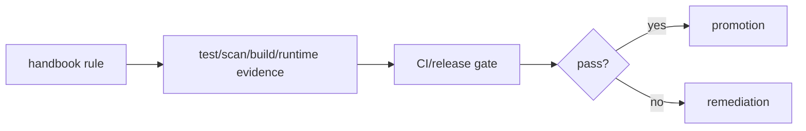

# Quality Gates

| Gate | Required evidence |
| --- | --- |
| documentation | `bun run docs:check`; every architecture page indexed; canonical trees/checklists present |
| i18n | locale parity, namespace ownership, source usage, formatters |
| architecture | public exports, dependency direction, forbidden imports, no global business ownership |
| code quality | typecheck, format/lint, focused and regression tests, no skipped tests |
| behavior | domain/application/schema/mapper/adapter/component tests with required failures |
| integration | contract compatibility, mock E2E, configured real E2E |
| accessibility/performance | semantic/keyboard/focus checks and measured budgets for changed flows |
| security | public config, secrets, dependencies, redaction, auth/tenant/permission evidence |
| delivery | reproducible build, image/SBOM/scan, immutable digest, smoke, rollback |
| operations | telemetry, correlation, health, reliability, owner/on-call evidence |

No unresolved architecture violation, broken handbook link, skipped test,
secret exposure, unbounded exception, or incompatible contract passes a release
gate.

## Gate checklist

- [ ] Evidence identifies exact source/artifact revisions and applicable app.
- [ ] Failure blocks promotion and points to an owner/action.
- [ ] Exceptions include owner, scope, risk, control, expiry, and follow-up.
- [ ] Real-environment gates declare credentials and data isolation policy.
- [ ] Handbook and plan status are updated with final evidence.
