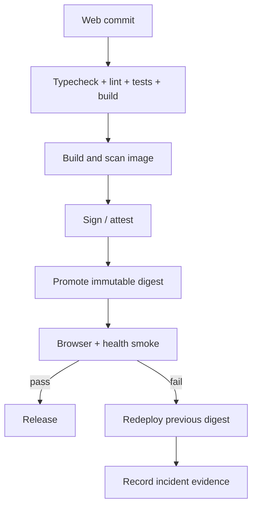

# Web Release

## Release flow

## Rules

- Record web commit, image digest, service compatibility window, and target.
- Promote the same immutable digest between environments.
- Do not use `latest` as production release evidence.
- Validate cache invalidation and service-worker upgrade behavior.
- Rollback means redeploying a known-good digest; it does not undo backend data
  migrations.
- Breaking service contracts require coordinated release evidence.
