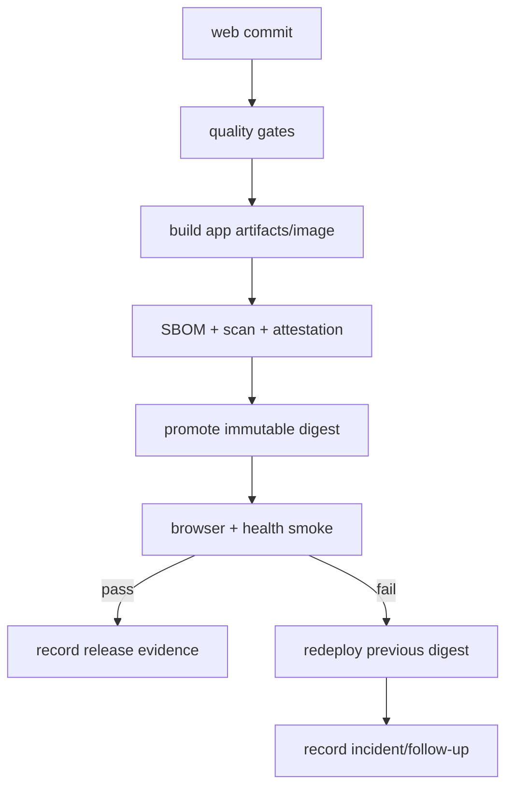

# Web Release

> **Status: Updated.** Immutable promotion, compatibility, and rollback detail
> is retained for all three app shells.

## Rules

- Record app identity, web commit, lockfile, artifact/image digest, target,
  service revision/contract window, and verification evidence.
- Promote the same immutable artifact between environments; `latest` is not
  release evidence.
- Apps may release independently only while shared packages and service
  contracts remain compatible.
- Breaking contracts require a coordinated compatibility window and migration.
- Validate cache invalidation, deep links, and service-worker behavior.
- Rollback redeploys a known-good frontend digest; it does not undo backend data
  migrations.
- Release notes name user-facing changes, migration needs, and bounded risks.

## Release checklist

- [ ] All [quality gates](quality-gates.md) pass for the exact revision.
- [ ] Artifact identity, SBOM, scan, attestation, and digest are recorded.
- [ ] Contract compatibility and required app/feature versions are proven.
- [ ] Protected environment approval and smoke evidence are present.
- [ ] Telemetry and rollback target are ready before promotion.
