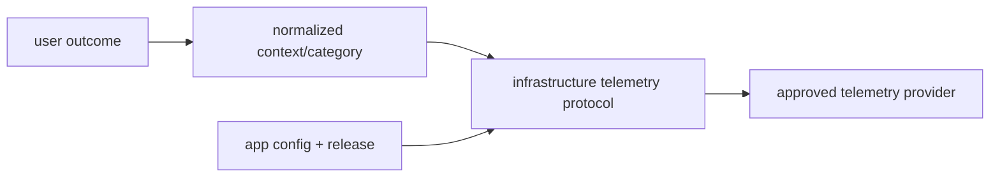

# Frontend Observability

> **Status: Updated.** `@emme/infrastructure` implements telemetry adapters;
> `@emme/core` supplies normalized runtime/error context; apps configure
> providers; features emit documented user-outcome signals only.

## Signals

- app/route/feature load and interaction timing;
- API outcome and bounded latency by contract category;
- validation, conflict, unavailable, retry-exhaustion, and error-boundary rates;
- session restore/expiry, tenant transition/mismatch, and permission denial;
- Web Vitals where tied to a user-facing objective;
- deployment version, app identity, and safe service correlation ID.

## Privacy rules

- Never send tokens, cookies, payment data, message content, free-form input, or
  unnecessary personal data.
- Use service correlation IDs; do not encode customer identity in metric labels.
- Record route templates, not sensitive query strings.
- Preserve diagnostic causes only inside approved redacted error reporting.
- Feature events describe outcomes, not private implementation details.

## Observability checklist

- [ ] A failed journey has app/release identity, category, and safe correlation.
- [ ] Startup, session/tenant, contract, retry, and boundary failures are visible.
- [ ] Event shape and redaction are tested with protocol fakes.
- [ ] Sensitive browser state is absent from logs, labels, and telemetry.
- [ ] Dashboard/alert ownership exists for promoted production signals.
