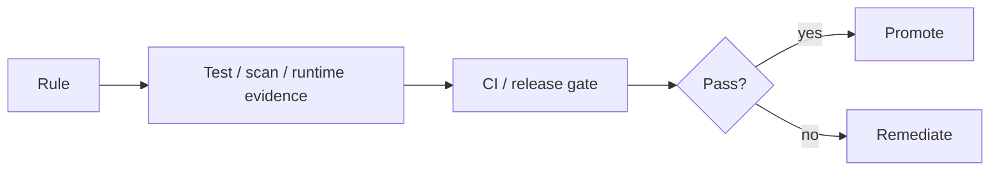

# Web Production Readiness

## Approval matrix

| Area | Evidence |
|---|---|
| Architecture | Feature/module boundary review and typed contract usage |
| Behavior | Unit/component tests and critical Playwright journeys |
| Accessibility | Keyboard/focus/semantic checks for changed flows |
| Security | Public runtime config review, headers, dependency/secret scan |
| Delivery | Frozen build, image scan, digest, non-root runtime check |
| Operations | Error telemetry, health smoke, rollback digest |
| Compatibility | Service contract version and coordinated window |

## Exception policy

An exception requires owner, scope, risk, compensating control, expiry, and
follow-up. “Production grade” is evidence across the matrix, not a label in a
README.

## Checklist

- [ ] Typecheck, lint, tests, and build pass.
- [ ] Critical journeys pass against the intended service contract.
- [ ] Public runtime configuration contains no private values.
- [ ] Image digest, scan, and source metadata are recorded.
- [ ] Health, telemetry, cache, and rollback behavior are verified.
