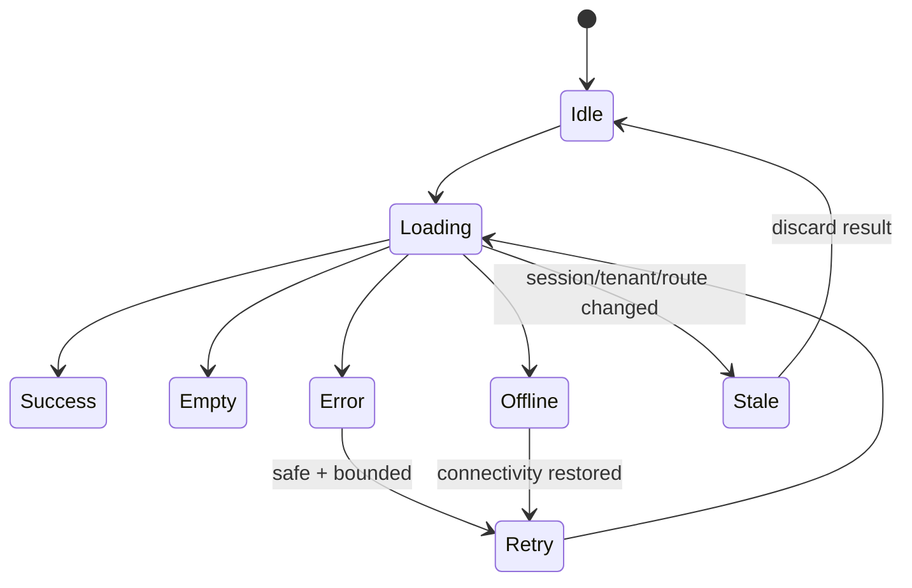

# Frontend Reliability

> **Status: Updated.** Detailed timeout, retry, stale-work, and recovery rules
> apply across all app workflows and feature adapters.

## Rules

- Bound timeout and retry at one adapter layer; never multiply retries across
  hooks, feature repositories, and global clients.
- Retry only safe/idempotent operations and expose exhaustion to presentation.
- Prevent duplicate mutations or use an explicit backend idempotency contract.
- Cancel or suppress stale work on route, session, tenant, or permission change.
- Loading, empty, error, offline, conflict, and permission-denied are first-class
  accessible states.
- Service-worker/cache behavior never makes an authenticated mutation appear
  successful or serves stale private tenant data.
- Error boundaries isolate unrelated routes without hiding telemetry.

## Reliability checklist

- [ ] Timeout, offline, bounded retry, and retry exhaustion are tested.
- [ ] Duplicate-click/idempotency and stale-response behavior are tested.
- [ ] Session expiry and tenant switch clear protected caches and in-flight work.
- [ ] Recovery is user-observable and preserves unsaved input when safe.
- [ ] Health/smoke, telemetry, safe degradation, and rollback evidence exist.
